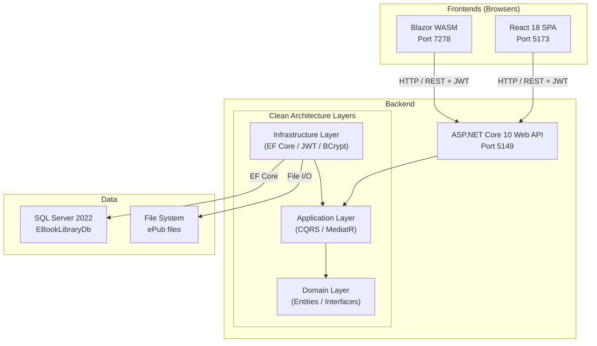

# Chapter 00 — Introduction

> *"The best way to learn software architecture is to build something real."*

---

## Chapter Objectives

By the end of this chapter you will:
- Understand what the EBook Library application does and why it was built
- Know the full technology stack and why each technology was chosen
- Have a mental model of the Clean Architecture layers before writing a single line of code
- Have your development environment ready to start Chapter 01

---

## 0.1 What Are We Building?

The **EBook Library** is a web application that allows users to browse, search, and download Spanish-language eBooks in ePub format. It was built as a learning project to demonstrate how a modern, production-quality .NET application is structured — from database to browser.

### Feature Summary

| Feature | Available To |
|---|---|
| Browse books by title, author, or genre | Everyone (anonymous) |
| Search the full 51,599-book catalog | Everyone |
| View book details (cover, metadata) | Everyone |
| Register and log in | Everyone |
| Download ePub files | Authenticated users |
| View personal download history | Authenticated users |
| Create / edit / delete books | Admin |
| Upload ePub files | Admin |
| Manage authors and genres | Admin |
| Manage user accounts | Admin |

### Two Frontends

One of the unique aspects of this project is that **two complete frontends** were built for the same API:

1. **React 18 + TypeScript** — the primary frontend, styled like Barnes & Noble, using modern React patterns (hooks, Zustand, React Query)
2. **Blazor WebAssembly** — an alternative frontend written entirely in C#, running in the browser via WebAssembly

This makes the project an excellent comparison study: same features, same API, completely different UI technology choices.

---

## 0.2 Why This Project?

Learning a new technology stack is most effective when you have a concrete, non-trivial problem to solve. A CRUD todo app teaches you the basics but skips the hard parts. A full-stack application like EBook Library forces you to confront:

- **Authentication** — stateless JWT tokens, role-based access control
- **Domain complexity** — books have many-to-many relationships with both authors and genres
- **Data scale** — seeding 51,599 records from real HTML export files
- **Two UI paradigms** — React (JavaScript ecosystem) vs. Blazor (C# ecosystem)
- **Testing strategy** — unit tests, integration tests, and end-to-end browser automation
- **Architecture decisions** — why does the Domain layer have zero external dependencies?

---

## 0.3 The Technology Stack — Explained

Every technology in this project was chosen for a reason. Understanding *why* before *how* makes the code make sense.

### .NET 10 / ASP.NET Core 10

Microsoft's flagship open-source framework for building web APIs and web apps. .NET 10 is the latest LTS release and offers:
- Cross-platform (Windows, macOS, Linux)
- Excellent performance (consistently top 10 in TechEmpower benchmarks)
- First-class support for Clean Architecture patterns

### Clean Architecture

A layered approach to organizing code where **business rules are the center** and all external concerns (database, UI, frameworks) are at the edges. The key rule: *dependencies can only point inward*.

```
UI / API → Application → Domain ← (nothing points out)
              ↑
        Infrastructure implements interfaces defined in Application
```

We use this because it makes the core business logic **testable without a database**, **swappable** (change SQL Server to PostgreSQL without touching business logic), and **understandable** (each layer has a single responsibility).

### CQRS (Command Query Responsibility Segregation)

A pattern that separates **write operations** (Commands) from **read operations** (Queries). Implemented via MediatR — a mediator library that dispatches requests to their handlers.

**Without CQRS:**
```csharp
// Controller directly uses a service with 20 methods
var books = _bookService.Search(filter); // hard to test, hard to extend
```

**With CQRS via MediatR:**
```csharp
// Controller sends a query, MediatR finds the handler
var books = await Mediator.Send(new SearchBooksQuery(filter));
// Clean, one handler = one responsibility, easy to test
```

### Entity Framework Core 10

Microsoft's ORM (Object-Relational Mapper) that maps C# classes to database tables. Instead of writing raw SQL, you write C# and EF Core generates the SQL. Key benefits:
- Database migrations (version-controlled schema changes)
- LINQ queries compile to SQL
- Change tracking (know what changed before saving)

### JWT (JSON Web Tokens)

A stateless authentication mechanism. After logging in, the server returns a signed token. The client sends this token with every request. The server validates the signature — **no session storage needed on the server**.

```
Login → Server returns JWT token
       │
       ▼
Client stores token in localStorage
       │
       ▼
Every API request includes: Authorization: Bearer <token>
       │
       ▼
Server validates signature + expiry → extracts user identity
```

### React 18 + TypeScript

A JavaScript library for building user interfaces using a component-based approach. TypeScript adds static typing, catching errors at compile time rather than runtime.

Key libraries used:
- **Vite** — lightning-fast build tool (replaces Create React App)
- **Tailwind CSS** — utility-first CSS framework
- **Zustand** — minimal global state management (auth state)
- **React Query** — server state management (caching, loading states, refetching)
- **i18next** — internationalization (Spanish + English)

### Blazor WebAssembly

Microsoft's framework for running C# in the browser via WebAssembly. You write C# code that compiles to a binary format the browser's WebAssembly runtime can execute — **no JavaScript required** for the application logic.

### xUnit + Playwright

- **xUnit** — .NET unit testing framework
- **Moq** — mock object library for isolating dependencies in unit tests
- **Playwright** — browser automation for end-to-end tests (clicks, forms, navigation)

---

## 0.4 Project Architecture — First Look

Before diving into each layer, here is the complete picture:



The API is the single entry point. Both frontends communicate via HTTP with JSON. The backend is layered internally: API → Application → Domain, with Infrastructure implementing the interfaces that Application defines.

---

## 0.5 The Data — 51,599 Real Books

The book catalog comes from three HTML export files (`lista_autor.html`, `lista_generos.html`, `lista_titulo.html`) containing metadata for over 51,000 Spanish-language books across 128 genres. This data was parsed and seeded into SQL Server using a custom `EBookLibrary.Seeder` console project.

Using real data (rather than random seeds) makes the application behave like a production system — search queries return meaningful results, genre filters are populated, and the UI looks like a real bookstore.

---

## 0.6 Manual vs. AI-Assisted Development

This project was built twice:
1. **Manual** — written by hand, every file crafted deliberately
2. **Automatic** — scaffolded with GitHub Copilot (Claude Sonnet) using structured prompt documents

Both implementations are in this repository. Chapter 13 compares the two approaches in detail: what Copilot generated accurately, what required correction, and where human judgment was irreplaceable.

> 🤖 **Copilot Tip:** Throughout this guide, sections marked with 🤖 discuss how AI tools can accelerate specific tasks. This is practical advice, not marketing — including honest notes on where Copilot made mistakes.

---

## 0.7 Setting Up Your Development Environment

### Step 1 — Install .NET 10 SDK

```bash
# Verify installation
dotnet --version
# Should output: 10.x.x
```

Download from: https://dotnet.microsoft.com/download/dotnet/10.0

### Step 2 — Install Node.js 20 LTS

```bash
# Verify installation
node --version   # Should output: v20.x.x or higher
npm --version    # Should output: 10.x.x or higher
```

Download from: https://nodejs.org (select LTS version)

### Step 3 — Install SQL Server 2022 Developer Edition

Download from: https://www.microsoft.com/sql-server/sql-server-downloads (free Developer edition)

Verify SQL Server is running:
```bash
# Windows (PowerShell)
Get-Service -Name "MSSQLSERVER" | Select-Object Status
# Should output: Running
```

### Step 4 — Install the EF Core CLI Tool

```bash
dotnet tool install --global dotnet-ef
dotnet ef --version
# Should output: 10.x.x
```

### Step 5 — Install VS Code Extensions

Open VS Code and install:
- **ms-dotnettools.csdevkit** — C# Dev Kit (IntelliSense, debugging, test explorer)
- **esbenp.prettier-vscode** — Prettier formatter
- **bradlc.vscode-tailwindcss** — Tailwind CSS IntelliSense
- **humao.rest-client** — REST Client for `.http` files
- **bierner.markdown-mermaid** — Mermaid diagram preview in Markdown

Or install all at once from the terminal:
```bash
code --install-extension ms-dotnettools.csdevkit
code --install-extension esbenp.prettier-vscode
code --install-extension bradlc.vscode-tailwindcss
code --install-extension humao.rest-client
code --install-extension bierner.markdown-mermaid
```

### Step 6 — Clone / Open the Reference Project

If you have access to the completed reference implementation:
```bash
# From the solution root
cd "Automatic/EBookLibrary"
dotnet build EBookLibrary.sln
# Should build 0 errors
```

---

## 0.8 Checkpoint ✅

Before moving to Chapter 01, verify:

- [ ] `dotnet --version` returns 10.x.x
- [ ] `node --version` returns v20.x.x or higher
- [ ] `dotnet ef --version` returns the EF Core tools version
- [ ] SQL Server service is running
- [ ] VS Code is open with the C# Dev Kit extension installed
- [ ] The reference project builds with 0 errors (optional but recommended)

---

## 0.9 🤖 AI-Assisted Development — This Chapter

This chapter requires no code generation. However, it is worth noting that the **project context document** (`docs/PROJECT_CONTEXT.md`) was designed as a structured AI prompt — a single file you can paste into a Copilot chat session to give the AI full context about the project before asking it to generate code.

> **Lesson:** Invest time in writing a good context document before using AI to generate code. A well-structured prompt document is the difference between getting useful output and getting generic boilerplate that doesn't fit your architecture.

---

## Further Reading

- [docs/PROJECT_CONTEXT.md](../docs/PROJECT_CONTEXT.md) — Complete project context document
- [docs/00-STEP-BY-STEP-GUIDE.md](../docs/00-STEP-BY-STEP-GUIDE.md) — Original phase-by-phase guide
- [docs/architecture/ARCHITECTURE.md](../docs/architecture/ARCHITECTURE.md) — Detailed architecture documentation
- Microsoft .NET Documentation: https://docs.microsoft.com/dotnet
- Clean Architecture (Robert C. Martin): https://blog.cleancoder.com/uncle-bob/2012/08/13/the-clean-architecture.html

---

**Next Chapter →** [01 — Architecture Deep Dive](01-ARCHITECTURE-DEEP-DIVE.md)
