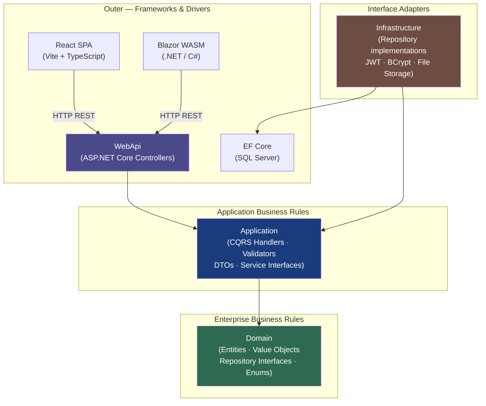
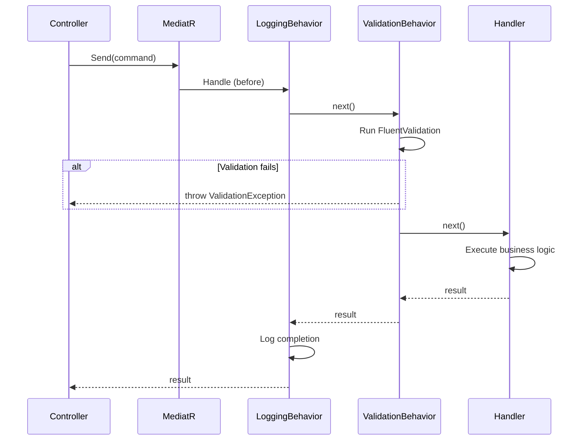
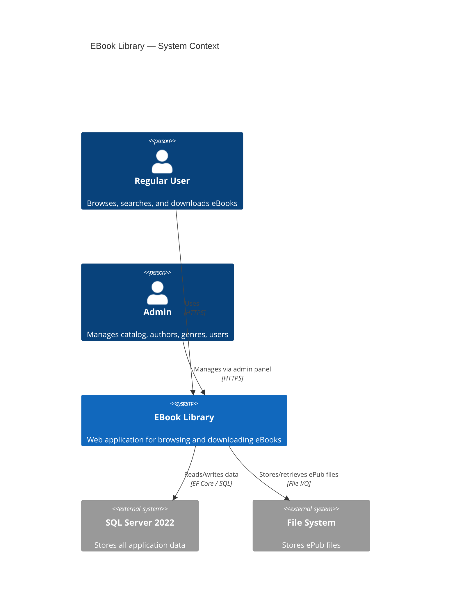
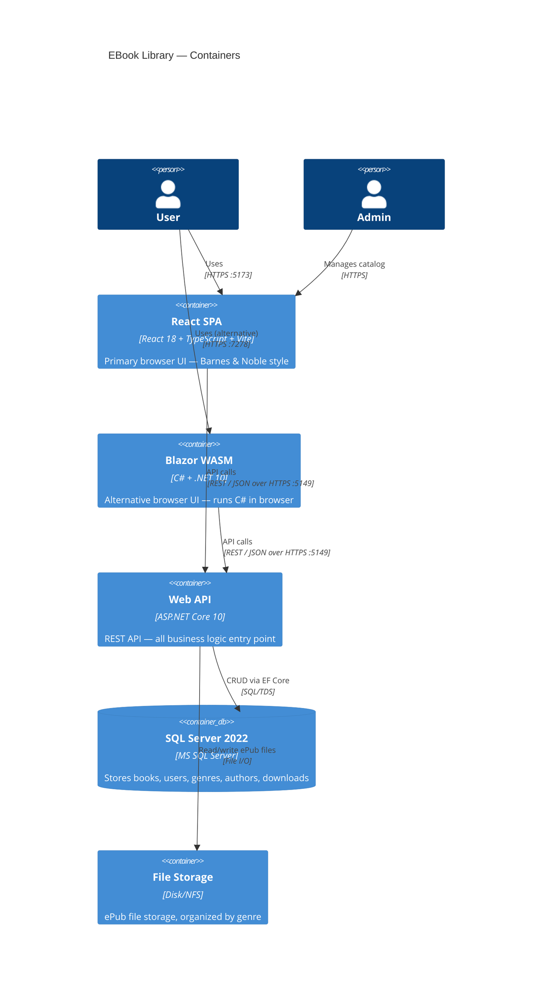
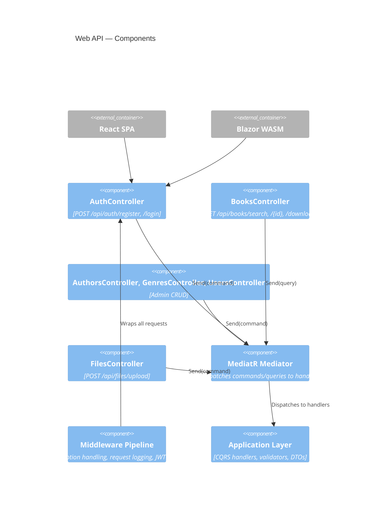
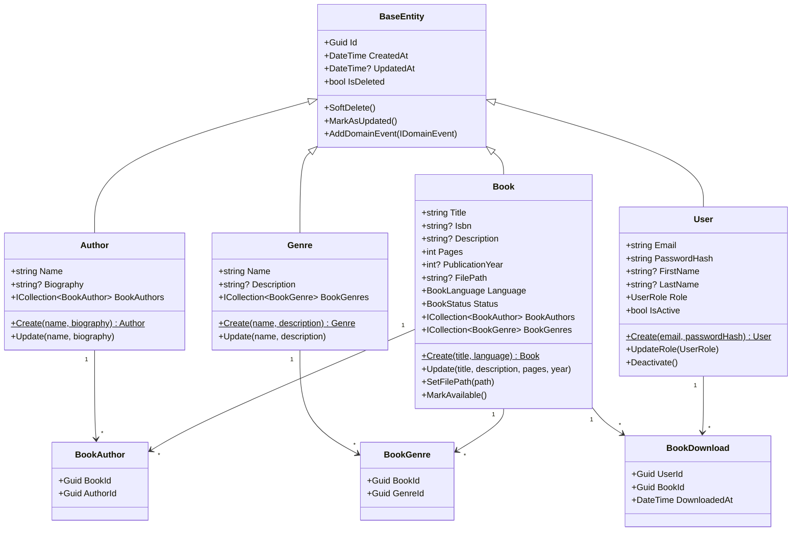
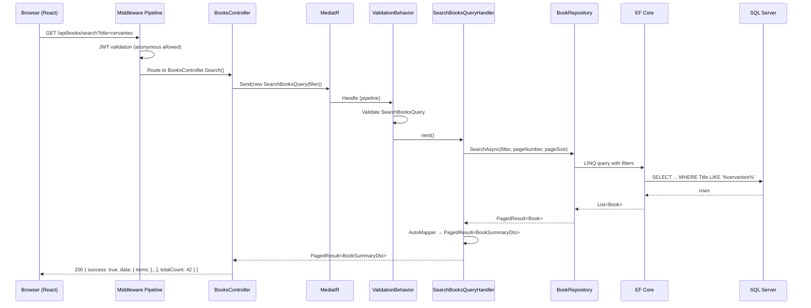
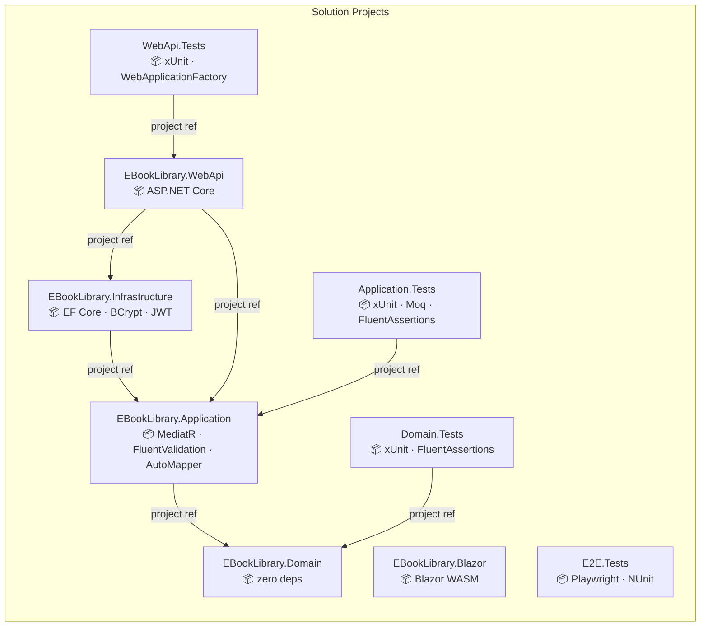

# Chapter 01 — Architecture Deep Dive

> *"Architecture is the decisions that are hard to change. Make them consciously."*

---

## Chapter Objectives

By the end of this chapter you will:
- Understand Clean Architecture and why it matters in a real project
- Be able to explain CQRS and why it improves testability
- Know the dependency rules that govern every file in this solution
- Read and interpret C4 architecture diagrams at all four levels
- Understand the key design decisions made in EBook Library and their trade-offs

---

## 1.1 The Problem with Traditional Layered Architecture

Before understanding Clean Architecture, consider the problem it solves.

In a traditional three-tier architecture, a typical flow looks like:

```
Controller → Service → Repository → Database
```

This works fine for small apps, but breaks down as complexity grows:
- The **Service** class imports the database ORM directly — you can't unit test it without a database
- Changing the database requires modifying **Service** classes
- Business logic leaks into controllers or repositories
- No clear boundary between "what the application does" and "how it does it"

**Clean Architecture** solves this by inverting dependencies: the inner layers define **interfaces**, and outer layers **implement** them.

---

## 1.2 Clean Architecture — The Layers



### The Dependency Rule (most important rule)

> **Source code dependencies must point inward. Nothing in an inner circle can know about something in an outer circle.**

| Layer | Can reference | Cannot reference |
|---|---|---|
| Domain | Nothing (pure .NET BCL) | Application, Infrastructure, WebApi |
| Application | Domain only | Infrastructure, WebApi |
| Infrastructure | Application + Domain | WebApi |
| WebApi | Application + Infrastructure | (no restriction — outermost) |

This rule is enforced by the `.csproj` project references:
```
Domain.csproj    → no references
Application.csproj → references Domain
Infrastructure.csproj → references Application
WebApi.csproj    → references Application + Infrastructure
```

**Why does this matter?**

You can write unit tests for your Application handlers without a database — because Application only depends on Domain interfaces, and you can mock them. If Infrastructure could bleed into Application, you'd need a real SQL Server to run tests.

---

## 1.3 The EBook Library Project Structure

```
EBookLibrary/
├── src/
│   ├── EBookLibrary.Domain/          ← Zero external NuGet dependencies
│   ├── EBookLibrary.Application/     ← MediatR, FluentValidation, AutoMapper
│   ├── EBookLibrary.Infrastructure/  ← EF Core, BCrypt, JWT
│   ├── EBookLibrary.WebApi/          ← ASP.NET Core 10 controllers
│   ├── EBookLibrary.React/           ← Vite + React 18 + TypeScript SPA
│   └── EBookLibrary.Blazor/          ← Blazor WebAssembly
├── tests/
│   ├── EBookLibrary.Domain.Tests/
│   ├── EBookLibrary.Application.Tests/
│   ├── EBookLibrary.WebApi.Tests/
│   └── EBookLibrary.E2E.Tests/       ← Playwright browser tests
└── scripts/
    └── EBookLibrary.Seeder/          ← Data seeding console app
```

---

## 1.4 CQRS — Command Query Responsibility Segregation

CQRS is a pattern that **separates read operations from write operations**.

### The Problem Without CQRS

```csharp
public class BookService
{
    // 20+ methods on one class — reads and writes mixed
    public Task<PagedResult<Book>> SearchAsync(BookFilter filter) { ... }
    public Task<Book> GetByIdAsync(Guid id) { ... }
    public Task<Book> CreateAsync(CreateBookDto dto) { ... }
    public Task UpdateAsync(Guid id, UpdateBookDto dto) { ... }
    public Task DeleteAsync(Guid id) { ... }
    public Task<string> UploadFileAsync(Stream file) { ... }
    public Task<string> DownloadFileAsync(Guid bookId) { ... }
    // ... more methods
}
```

This class becomes a "God Service" — impossible to test in isolation, violates Single Responsibility.

### The Solution — MediatR Handlers

With CQRS, each operation is a **separate class**:

```
Commands (write, mutate state):
├── RegisterUserCommand + RegisterUserCommandHandler
├── LoginUserCommand + LoginUserCommandHandler
├── CreateBookCommand + CreateBookCommandHandler
├── UpdateBookCommand + UpdateBookCommandHandler
├── DeleteBookCommand + DeleteBookCommandHandler
└── DownloadBookCommand + DownloadBookCommandHandler

Queries (read, return data):
├── SearchBooksQuery + SearchBooksQueryHandler
├── GetBookByIdQuery + GetBookByIdQueryHandler
├── GetAuthorByIdQuery + GetAuthorByIdQueryHandler
└── GetUsersPagedQuery + GetUsersPagedQueryHandler
```

Each handler has exactly **one responsibility**. Testing is trivial:

```csharp
[Fact]
public async Task Handle_ValidCredentials_ReturnsToken()
{
    // Arrange — mock only what this handler needs
    var uow = TestMockFactory.CreateUnitOfWork(users: userRepoMock);
    var jwt = TestMockFactory.CreateJwtService("test-token");
    var handler = new LoginUserCommandHandler(uow.Object, jwt.Object, passwordHash.Object);

    // Act
    var result = await handler.Handle(new LoginUserCommand("user@test.com", "pass"), default);

    // Assert
    result.Token.Should().Be("test-token");
}
```

### The MediatR Pipeline

MediatR does more than just dispatch requests. It supports **pipeline behaviors** — middleware that runs before and after every handler:



Every command/query automatically gets:
1. **Request logging** (LoggingBehavior) — logs the request type and execution time
2. **Validation** (ValidationBehavior) — runs FluentValidation, throws on failure

This is cross-cutting concern handling without polluting handlers.

---

## 1.5 C4 Architecture Model

The C4 model describes a system at four levels of abstraction. Think of it like Google Maps zoom levels: zooming in reveals more detail.

### Level 1 — System Context

*Who uses the system, and what external systems does it interact with?*



### Level 2 — Container

*What deployable units make up the system?*



### Level 3 — Component (Web API)

*What are the major components inside the Web API container?*



### Level 4 — Code (Domain)

*What are the classes inside the Domain layer?*



---

## 1.6 Key Design Decisions

Understanding *why* certain choices were made prevents you from second-guessing them during implementation.

### Decision 1 — Controller-based API, not Minimal APIs

**Choice:** ASP.NET Core controller-based API  
**Alternative considered:** Minimal APIs (the newer ASP.NET Core approach)  
**Reason:** For a project this size (8+ controllers, complex middleware, role-based auth), controllers provide better organization. Minimal APIs are excellent for small, focused services. Controllers also integrate better with existing tooling like Swagger/Scalar attribute-based documentation.

### Decision 2 — Soft Delete Strategy

**Choice:** All entities have `IsDeleted` (bool) + global query filters in EF Core  
**Alternative considered:** Hard delete (permanent removal)  
**Reason:** In a library system, deleting a book that users have downloaded could cause referential integrity issues. Soft delete allows the record to remain in the DB (maintaining FK constraints) while hiding it from normal queries.

**Implementation:**
```csharp
// In AppDbContext.OnModelCreating:
modelBuilder.Entity<Book>().HasQueryFilter(b => !b.IsDeleted);
// Every LINQ query on Books automatically adds WHERE IsDeleted = 0
```

### Decision 3 — Repository + Unit of Work Pattern over Direct DbContext

**Choice:** `IBookRepository`, `IAuthorRepository`, etc. accessed via `IUnitOfWork`  
**Alternative considered:** Inject `AppDbContext` directly into Application handlers  
**Reason:** 
1. **Testability** — mock `IUnitOfWork` without a real database
2. **Abstraction** — Application layer doesn't know about EF Core
3. **Transaction management** — `IUnitOfWork.SaveChangesAsync()` batches all changes in one transaction

### Decision 4 — No Refresh Tokens in v1

**Choice:** JWT tokens expire in 60 minutes, no refresh mechanism  
**Alternative considered:** Refresh token rotation (Redis-backed or DB-backed)  
**Reason:** Simplicity for v1. The learning focus is the architecture pattern, not token lifecycle management. Adding refresh tokens is a natural v2 enhancement exercise (see Appendix B).

### Decision 5 — JWT in localStorage (Not httpOnly Cookies)

**Choice:** JWT token stored in browser `localStorage`  
**Alternative considered:** httpOnly cookies (more secure against XSS)  
**Reason:** Simplicity and CORS compatibility for a learning project. In production, httpOnly cookies would be the recommended approach. This trade-off is documented in the codebase.

> **Security note:** If you adapt this project for production use, replace `localStorage` JWT storage with httpOnly cookies and implement CSRF protection.

### Decision 6 — Database-Agnostic Design

**Choice:** EF Core with SQL Server, but the design allows switching providers  
**Implementation:** Only `DependencyInjection.cs` in Infrastructure references `UseSqlServer()`. Switching to PostgreSQL requires changing one line: `UseSqlServer()` → `UseNpgsql()`.

---

## 1.7 Request Flow — End to End

Tracing a complete request through all layers makes the architecture tangible. Here is the flow for `GET /api/books/search?title=cervantes`:



Every layer has a single, clear responsibility. No layer knows about the details of the layers outside it.

---

## 1.8 Dependency Flow Diagram



---

## 1.9 Checkpoint ✅

Before moving to Chapter 02, you should be able to:

- [ ] Explain why the Domain layer has zero external NuGet dependencies
- [ ] Describe what CQRS is and how MediatR implements it
- [ ] Trace a request from the browser to the database and back through all layers
- [ ] Identify which project references which in the solution
- [ ] Explain the soft delete pattern and why it was chosen

---

## 1.10 🤖 AI-Assisted Development — Architecture

Architecture decisions are one area where AI tools are **least reliable**. Copilot can generate structurally correct code following Clean Architecture patterns, but it cannot:
- Know which trade-offs matter for your specific project
- Understand non-functional requirements (scale, team size, operational complexity)
- Make judgment calls about when simplicity beats purity

**What Copilot did well in this chapter's scope:**
- Generated the `BaseEntity` class with correct soft delete + domain event patterns
- Set up project references in `.csproj` files accurately
- Suggested appropriate NuGet packages per layer

**What required human judgment:**
- Decision to use controller-based API vs. minimal APIs
- Choosing not to implement refresh tokens in v1
- Deciding where to put responsibility boundaries (what goes in Application vs. Domain)

> **Lesson:** Use AI to generate structure; use your judgment for architectural decisions.

---

## Further Reading

- [docs/architecture/ARCHITECTURE.md](../docs/architecture/ARCHITECTURE.md) — Complete architecture document with all 17 diagrams
- [docs/architecture/diagrams/](../docs/architecture/diagrams/) — Source `.drawio` diagram files
- Clean Architecture by Robert C. Martin (book)
- MediatR documentation: https://github.com/jbogard/MediatR
- C4 Model: https://c4model.com

---

**← Previous:** [00 — Introduction](00-INTRODUCTION.md)  
**Next →** [02 — Solution Setup](02-SOLUTION-SETUP.md)
