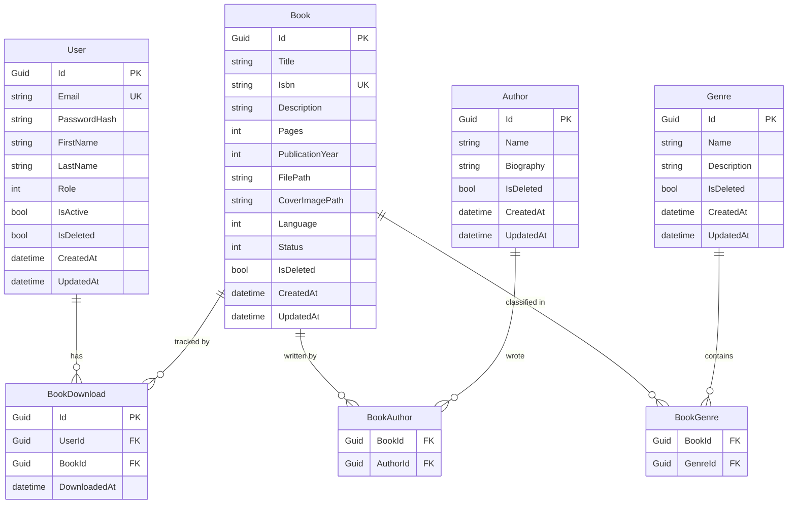

# Chapter 03 — Domain Layer

> *"The Domain is the heart of the application. Everything else exists to serve it."*

---

## Chapter Objectives

By the end of this chapter you will:
- Understand Domain-Driven Design (DDD) concepts as applied in this project
- Have all 7 domain entities implemented with factory methods and business rules
- Have repository interfaces defined as contracts for the Infrastructure layer
- Understand why the Domain project has zero external NuGet dependencies

---

## 3.1 What is the Domain Layer?

The Domain layer contains the **essence of your application** — the business rules, the data structures, and the operations that would exist even if you switched databases or removed the API entirely.

In EBook Library, the domain answers questions like:
- What is a `Book`? What properties does it have? What can it do?
- What rules must always hold? (A book's title cannot be empty, an author's name cannot exceed 300 characters)
- How are books related to authors and genres?

### What the Domain Layer contains

| Concept | File | Purpose |
|---|---|---|
| Base Entity | `Common/BaseEntity.cs` | Shared identity, timestamps, soft delete |
| Entities | `Entities/*.cs` | Core business objects with identity |
| Enums | `Enums/*.cs` | Domain-specific enumeration types |
| Domain Events | `Events/IDomainEvent.cs` | Notification interface for things that happened |
| Repository Interfaces | `Interfaces/Repositories/I*.cs` | Contracts for data access (implemented in Infrastructure) |

### What the Domain Layer does NOT contain

- No EF Core annotations (`[Key]`, `[Column]`, etc.)
- No HTTP concepts (requests, responses)
- No MediatR or other framework dependencies
- No file I/O or network calls

---

## 3.2 BaseEntity — The Foundation

Every entity in this project inherits from `BaseEntity`. Create this file first:

**File:** `src/EBookLibrary.Domain/Common/BaseEntity.cs`

```csharp
namespace EBookLibrary.Domain.Common;

public abstract class BaseEntity
{
    public Guid Id { get; protected set; } = Guid.NewGuid();
    public DateTime CreatedAt { get; protected set; } = DateTime.UtcNow;
    public DateTime? UpdatedAt { get; protected set; }
    public bool IsDeleted { get; protected set; } = false;

    private readonly List<IDomainEvent> _domainEvents = new();
    public IReadOnlyCollection<IDomainEvent> DomainEvents => _domainEvents.AsReadOnly();

    protected void AddDomainEvent(IDomainEvent domainEvent)
        => _domainEvents.Add(domainEvent);

    public void ClearDomainEvents()
        => _domainEvents.Clear();

    public void MarkAsUpdated()
        => UpdatedAt = DateTime.UtcNow;

    public void SoftDelete()
    {
        IsDeleted = true;
        UpdatedAt = DateTime.UtcNow;
    }
}
```

### Why `protected set` on `Id`?

Properties use `protected set` instead of `private set` so derived entity classes (like `Book`) can set values in their factory methods, but external code cannot mutate these properties directly:

```csharp
var book = Book.Create("Don Quixote", BookLanguage.Spanish);
book.Id = Guid.NewGuid(); // ← Compile error: cannot assign to protected setter
```

### The Domain Events Pattern

`IDomainEvent` (defined next) allows entities to record that something significant happened. These events are dispatched by the Application layer after saving to the database. For now, it's a foundation for future use — EBook Library v1 doesn't actively dispatch domain events, but the infrastructure is in place.

---

## 3.3 Domain Events Interface

**File:** `src/EBookLibrary.Domain/Events/IDomainEvent.cs`

```csharp
namespace EBookLibrary.Domain.Events;

/// <summary>
/// Marker interface for domain events.
/// Raised within entities, dispatched by the Application layer.
/// </summary>
public interface IDomainEvent
{
    Guid Id { get; }
    DateTime OccurredAt { get; }
}
```

> **Note:** You'll see some examples where `IDomainEvent` inherits from `MediatR.INotification`. We deliberately keep it as a plain interface to maintain Domain's zero-dependency rule. The Application layer translates domain events to MediatR notifications when dispatching.

---

## 3.4 Enums

**File:** `src/EBookLibrary.Domain/Enums/UserRole.cs`

```csharp
namespace EBookLibrary.Domain.Enums;

public enum UserRole
{
    Regular = 1,
    Admin = 2
}
```

**File:** `src/EBookLibrary.Domain/Enums/BookLanguage.cs`

```csharp
namespace EBookLibrary.Domain.Enums;

public enum BookLanguage
{
    Spanish = 1,
    English = 2,
    Other = 3
}
```

**File:** `src/EBookLibrary.Domain/Enums/BookStatus.cs`

```csharp
namespace EBookLibrary.Domain.Enums;

public enum BookStatus
{
    Available = 1,      // ePub file exists on disk and is downloadable
    Unavailable = 2,    // Book record exists but file has not been uploaded yet
    Removed = 3         // Soft-deleted — not shown in catalog
}
```

> **Design choice:** Enums use explicit integer values (starting at 1) to prevent EF Core from storing `0` as a default. If a new enum value is accidentally initialized without assignment, it won't silently default to the first enum member.

---

## 3.5 Core Entities

### Author Entity

**File:** `src/EBookLibrary.Domain/Entities/Author.cs`

```csharp
namespace EBookLibrary.Domain.Entities;

public sealed class Author : BaseEntity
{
    public string Name { get; private set; } = string.Empty;
    public string? Biography { get; private set; }

    // Navigation property — EF Core uses this for joins
    public ICollection<BookAuthor> BookAuthors { get; private set; } = new List<BookAuthor>();

    private Author() { } // Required by EF Core (private parameterless constructor)

    /// <summary>Factory method — the only public way to create an Author</summary>
    public static Author Create(string name, string? biography = null)
    {
        ArgumentException.ThrowIfNullOrWhiteSpace(name, nameof(name));
        if (name.Length > 300)
            throw new ArgumentException("Author name cannot exceed 300 characters.", nameof(name));

        return new Author
        {
            Name = name.Trim(),
            Biography = biography?.Trim()
        };
    }

    public void Update(string name, string? biography)
    {
        ArgumentException.ThrowIfNullOrWhiteSpace(name, nameof(name));
        if (name.Length > 300)
            throw new ArgumentException("Author name cannot exceed 300 characters.", nameof(name));

        Name = name.Trim();
        Biography = biography?.Trim();
        MarkAsUpdated();
    }
}
```

#### Key Patterns Explained

**Factory Method (`static Author Create(...)`):**  
Instead of a public constructor, creation goes through a static factory method. This allows the method to:
1. Validate inputs before the object is created
2. Return a fully initialized entity (never partially constructed)
3. Be the single place where creation business rules live

**Private Parameterless Constructor:**  
EF Core requires a parameterless constructor to materialize objects from database rows. Making it `private` means application code cannot accidentally bypass the factory method.

**Private Setters:**  
Properties can only be changed through methods like `Update()`. This enforces that all mutations go through the entity's own methods, which can enforce invariants.

---

### Genre Entity

**File:** `src/EBookLibrary.Domain/Entities/Genre.cs`

```csharp
namespace EBookLibrary.Domain.Entities;

public sealed class Genre : BaseEntity
{
    public string Name { get; private set; } = string.Empty;
    public string? Description { get; private set; }

    public ICollection<BookGenre> BookGenres { get; private set; } = new List<BookGenre>();

    private Genre() { }

    public static Genre Create(string name, string? description = null)
    {
        ArgumentException.ThrowIfNullOrWhiteSpace(name, nameof(name));
        if (name.Length > 100)
            throw new ArgumentException("Genre name cannot exceed 100 characters.", nameof(name));

        return new Genre
        {
            Name = name.Trim(),
            Description = description?.Trim()
        };
    }

    public void Update(string name, string? description)
    {
        ArgumentException.ThrowIfNullOrWhiteSpace(name, nameof(name));
        Name = name.Trim();
        Description = description?.Trim();
        MarkAsUpdated();
    }
}
```

---

### Book Entity (Most Complex)

The `Book` entity has the most business rules and the most complex relationships — it connects to authors (many-to-many) and genres (many-to-many).

**File:** `src/EBookLibrary.Domain/Entities/Book.cs`

```csharp
namespace EBookLibrary.Domain.Entities;

public sealed class Book : BaseEntity
{
    public string Title { get; private set; } = string.Empty;
    public string? Isbn { get; private set; }
    public string? Description { get; private set; }
    public int Pages { get; private set; }
    public int? PublicationYear { get; private set; }
    public string? FilePath { get; private set; }         // Relative path to ePub file
    public string? CoverImagePath { get; private set; }   // Relative path to cover image
    public BookLanguage Language { get; private set; }
    public BookStatus Status { get; private set; } = BookStatus.Unavailable;

    // Navigation properties
    public ICollection<BookAuthor> BookAuthors { get; private set; } = new List<BookAuthor>();
    public ICollection<BookGenre> BookGenres { get; private set; } = new List<BookGenre>();
    public ICollection<BookDownload> Downloads { get; private set; } = new List<BookDownload>();

    private Book() { }

    public static Book Create(
        string title,
        BookLanguage language = BookLanguage.Spanish,
        string? isbn = null,
        string? description = null,
        int pages = 0,
        int? publicationYear = null)
    {
        ArgumentException.ThrowIfNullOrWhiteSpace(title, nameof(title));
        if (title.Length > 500)
            throw new ArgumentException("Book title cannot exceed 500 characters.", nameof(title));
        if (pages < 0)
            throw new ArgumentException("Pages cannot be negative.", nameof(pages));
        if (publicationYear.HasValue && (publicationYear < 1000 || publicationYear > DateTime.UtcNow.Year + 5))
            throw new ArgumentException("Publication year is out of valid range.", nameof(publicationYear));

        return new Book
        {
            Title = title.Trim(),
            Language = language,
            Isbn = isbn?.Trim(),
            Description = description?.Trim(),
            Pages = pages,
            PublicationYear = publicationYear,
            Status = BookStatus.Unavailable
        };
    }

    public void Update(
        string title,
        string? description,
        int pages,
        int? publicationYear,
        BookLanguage language,
        string? isbn = null)
    {
        ArgumentException.ThrowIfNullOrWhiteSpace(title, nameof(title));
        Title = title.Trim();
        Description = description?.Trim();
        Pages = pages;
        PublicationYear = publicationYear;
        Language = language;
        Isbn = isbn?.Trim();
        MarkAsUpdated();
    }

    /// <summary>Called when an ePub file is uploaded for this book</summary>
    public void SetFilePath(string relativePath)
    {
        ArgumentException.ThrowIfNullOrWhiteSpace(relativePath, nameof(relativePath));
        FilePath = relativePath;
        Status = BookStatus.Available;
        MarkAsUpdated();
    }

    public void SetCoverImagePath(string relativePath)
    {
        CoverImagePath = relativePath;
        MarkAsUpdated();
    }

    /// <summary>Check whether this book can be downloaded</summary>
    public bool IsAvailableForDownload()
        => Status == BookStatus.Available && !string.IsNullOrEmpty(FilePath) && !IsDeleted;
}
```

---

### User Entity

**File:** `src/EBookLibrary.Domain/Entities/User.cs`

```csharp
namespace EBookLibrary.Domain.Entities;

public sealed class User : BaseEntity
{
    public string Email { get; private set; } = string.Empty;
    public string PasswordHash { get; private set; } = string.Empty;
    public string? FirstName { get; private set; }
    public string? LastName { get; private set; }
    public UserRole Role { get; private set; } = UserRole.Regular;
    public bool IsActive { get; private set; } = true;

    public ICollection<BookDownload> Downloads { get; private set; } = new List<BookDownload>();

    private User() { }

    public static User Create(
        string email,
        string passwordHash,
        string? firstName = null,
        string? lastName = null)
    {
        ArgumentException.ThrowIfNullOrWhiteSpace(email, nameof(email));
        ArgumentException.ThrowIfNullOrWhiteSpace(passwordHash, nameof(passwordHash));

        return new User
        {
            Email = email.ToLowerInvariant().Trim(),
            PasswordHash = passwordHash,
            FirstName = firstName?.Trim(),
            LastName = lastName?.Trim(),
            Role = UserRole.Regular,
            IsActive = true
        };
    }

    public void UpdateRole(UserRole newRole)
    {
        Role = newRole;
        MarkAsUpdated();
    }

    public void Deactivate()
    {
        IsActive = false;
        MarkAsUpdated();
    }

    public void Activate()
    {
        IsActive = true;
        MarkAsUpdated();
    }

    public void UpdateProfile(string? firstName, string? lastName)
    {
        FirstName = firstName?.Trim();
        LastName = lastName?.Trim();
        MarkAsUpdated();
    }

    public void UpdateEmail(string email)
    {
        ArgumentException.ThrowIfNullOrWhiteSpace(email, nameof(email));
        Email = email.Trim().ToLowerInvariant();
        MarkAsUpdated();
    }

    public void ResetPassword(string passwordHash)
    {
        ArgumentException.ThrowIfNullOrWhiteSpace(passwordHash, nameof(passwordHash));
        PasswordHash = passwordHash;
        MarkAsUpdated();
    }
}
```

> **Note on email storage:** `email.ToLowerInvariant()` normalizes the email to lowercase. This prevents duplicate registrations with `User@Example.com` vs. `user@example.com`.

---

### Join Entities (Many-to-Many)

These are simple classes that represent the database join tables:

**File:** `src/EBookLibrary.Domain/Entities/BookAuthor.cs`

```csharp
namespace EBookLibrary.Domain.Entities;

public sealed class BookAuthor
{
    public Guid BookId { get; private set; }
    public Guid AuthorId { get; private set; }

    // Navigation properties
    public Book Book { get; private set; } = null!;
    public Author Author { get; private set; } = null!;

    private BookAuthor() { }

    public static BookAuthor Create(Guid bookId, Guid authorId)
        => new() { BookId = bookId, AuthorId = authorId };
}
```

**File:** `src/EBookLibrary.Domain/Entities/BookGenre.cs`

```csharp
namespace EBookLibrary.Domain.Entities;

public sealed class BookGenre
{
    public Guid BookId { get; private set; }
    public Guid GenreId { get; private set; }

    public Book Book { get; private set; } = null!;
    public Genre Genre { get; private set; } = null!;

    private BookGenre() { }

    public static BookGenre Create(Guid bookId, Guid genreId)
        => new() { BookId = bookId, GenreId = genreId };
}
```

**File:** `src/EBookLibrary.Domain/Entities/BookDownload.cs`

```csharp
namespace EBookLibrary.Domain.Entities;

/// <summary>Tracks every time a user downloads a book</summary>
public sealed class BookDownload
{
    public Guid Id { get; private set; } = Guid.NewGuid();
    public Guid UserId { get; private set; }
    public Guid BookId { get; private set; }
    public DateTime DownloadedAt { get; private set; } = DateTime.UtcNow;

    public User User { get; private set; } = null!;
    public Book Book { get; private set; } = null!;

    private BookDownload() { }

    public static BookDownload Create(Guid userId, Guid bookId)
        => new() { UserId = userId, BookId = bookId };
}
```

---

## 3.6 Repository Interfaces

Repository interfaces define **what data access operations are needed** without specifying how they're implemented. They live in Domain so the Application layer can use them without depending on Infrastructure.

**File:** `src/EBookLibrary.Domain/Interfaces/Repositories/IGenericRepository.cs`

```csharp
namespace EBookLibrary.Domain.Interfaces.Repositories;

public interface IGenericRepository<T> where T : BaseEntity
{
    Task<T?> GetByIdAsync(Guid id, CancellationToken ct = default);
    Task<IEnumerable<T>> GetAllAsync(CancellationToken ct = default);
    Task AddAsync(T entity, CancellationToken ct = default);
    void Update(T entity);
    void Delete(T entity);   // Soft delete — sets IsDeleted = true
    Task<bool> ExistsAsync(Guid id, CancellationToken ct = default);
}
```

**File:** `src/EBookLibrary.Domain/Interfaces/Repositories/IBookRepository.cs`

```csharp
namespace EBookLibrary.Domain.Interfaces.Repositories;

public interface IBookRepository : IGenericRepository<Book>
{
    Task<(IEnumerable<Book> Items, int TotalCount)> SearchAsync(
        string? title,
        string? authorName,
        string? genreName,
        int? publicationYear,
        int pageNumber,
        int pageSize,
        CancellationToken ct = default);

    Task<Book?> GetByIdWithDetailsAsync(Guid id, CancellationToken ct = default);
    Task<Book?> GetByIsbnAsync(string isbn, CancellationToken ct = default);
    Task<(IEnumerable<Book> Items, int TotalCount)> GetPagedAsync(int pageNumber, int pageSize, CancellationToken ct = default);
}
```

**File:** `src/EBookLibrary.Domain/Interfaces/Repositories/IAuthorRepository.cs`

```csharp
namespace EBookLibrary.Domain.Interfaces.Repositories;

public interface IAuthorRepository : IGenericRepository<Author>
{
    Task<Author?> GetByNameAsync(string name, CancellationToken ct = default);
    Task<(IEnumerable<Author> Items, int TotalCount)> GetPagedAsync(
        int pageNumber, int pageSize, CancellationToken ct = default);
}
```

**File:** `src/EBookLibrary.Domain/Interfaces/Repositories/IUserRepository.cs`

```csharp
namespace EBookLibrary.Domain.Interfaces.Repositories;

public interface IUserRepository : IGenericRepository<User>
{
    Task<User?> GetByEmailAsync(string email, CancellationToken ct = default);
    Task<bool> EmailExistsAsync(string email, CancellationToken ct = default);
    Task<(IEnumerable<User> Items, int TotalCount)> GetPagedAsync(
        int pageNumber, int pageSize, CancellationToken ct = default);
}
```

**File:** `src/EBookLibrary.Domain/Interfaces/Repositories/IUnitOfWork.cs`

```csharp
namespace EBookLibrary.Domain.Interfaces.Repositories;

/// <summary>
/// Unit of Work aggregates all repositories and provides a single SaveChangesAsync().
/// Handlers receive IUnitOfWork, access repositories through it, and call SaveChangesAsync once.
/// This ensures all changes in a handler are committed in a single transaction.
/// </summary>
public interface IUnitOfWork : IDisposable
{
    IBookRepository Books { get; }
    IAuthorRepository Authors { get; }
    IGenreRepository Genres { get; }
    IUserRepository Users { get; }
    IBookDownloadRepository BookDownloads { get; }

    Task<int> SaveChangesAsync(CancellationToken ct = default);
}
```

---

## 3.7 Entity Relationship Diagram



---

## 3.8 Compile Verification

After creating all domain files, verify the Domain project compiles:

```bash
dotnet build src/EBookLibrary.Domain/EBookLibrary.Domain.csproj
```

Check no NuGet packages were inadvertently added:

```bash
# This command should show NO package references for Domain:
dotnet list src/EBookLibrary.Domain package
# Expected output: "There are no PackageReference elements" or similar
```

---

## 3.9 Checkpoint ✅

The Domain layer is complete when:

- [ ] `BaseEntity.cs` exists in `Common/`
- [ ] `IDomainEvent.cs` exists in `Events/`
- [ ] Three enums: `UserRole`, `BookLanguage`, `BookStatus`
- [ ] Seven entity files: `Author`, `Genre`, `Book`, `User`, `BookAuthor`, `BookGenre`, `BookDownload`
- [ ] Repository interfaces: `IGenericRepository<T>`, `IBookRepository`, `IAuthorRepository`, `IGenreRepository`, `IUserRepository`, `IBookDownloadRepository`, `IUnitOfWork`
- [ ] `dotnet build src/EBookLibrary.Domain` succeeds with 0 errors
- [ ] `dotnet list src/EBookLibrary.Domain package` shows no packages

---

## 3.10 🤖 AI-Assisted Development — Domain Layer

The Domain layer is **ideal for AI generation** because:
- The patterns are well-established (factory methods, private constructors, private setters)
- The rules are explicit and can be stated precisely in a prompt
- There are no external dependencies to get wrong

**What Copilot generated correctly:**
- All entity classes with factory methods and private setters
- Repository interface signatures
- The `BaseEntity` with soft delete and domain events

**What required review:**
- `IDomainEvent` — initial generation had it inherit `MediatR.INotification`, which would add a NuGet dependency to Domain. This was corrected to a plain interface.
- `User.Email` normalization — initial generation did not include `ToLowerInvariant()`. Email uniqueness bugs would have appeared in production.

> **Prompt pattern that worked well:**  
> *"Generate a `Book` entity for a .NET 10 class library with zero external NuGet dependencies. Use a static factory method `Create()`, private setters, and a private parameterless constructor for EF Core. The entity must inherit BaseEntity (which provides Id, CreatedAt, UpdatedAt, IsDeleted, SoftDelete(), MarkAsUpdated())."*

---

## Further Reading

- [docs/02-DOMAIN-LAYER.md](../docs/02-DOMAIN-LAYER.md) — Original domain layer prompt document with full entity code
- Domain-Driven Design by Eric Evans (book — the foundational reference)
- Microsoft: Entity Framework Core with Clean Architecture: https://docs.microsoft.com/ef/core/

---

**← Previous:** [02 — Solution Setup](02-SOLUTION-SETUP.md)  
**Next →** [04 — Application Layer](04-APPLICATION-LAYER.md)
