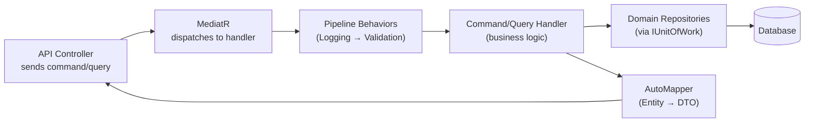

# Chapter 04 — Application Layer (CQRS)

> *"A handler that does one thing is a handler you can trust, test, and change."*

---

## Chapter Objectives

By the end of this chapter you will:
- Have all CQRS Commands and Queries implemented for the full application
- Understand the MediatR pipeline and how behaviors enhance it
- Know how FluentValidation integrates with the pipeline automatically
- Have the `Result<T>` pattern implemented for error handling without exceptions
- Have AutoMapper profiles mapping domain entities to DTOs

---

## 4.1 What the Application Layer Does

The Application layer is the **orchestrator**. It:
1. Receives a command or query from the API layer
2. Validates it (FluentValidation)
3. Calls domain repositories/services to perform the operation
4. Returns a DTO (not the domain entity itself)



**What Application does NOT do:**
- No direct database code (uses `IUnitOfWork` interfaces)
- No HTTP concerns (no `IActionResult`, no status codes)
- No knowledge of EF Core, SQL Server, or JWT implementation

---

## 4.2 Common Infrastructure

### Result Pattern

Instead of throwing exceptions for expected failures (invalid credentials, not found), handlers return a `Result<T>`:

**File:** `src/EBookLibrary.Application/Common/Models/Result.cs`

```csharp
namespace EBookLibrary.Application.Common.Models;

/// <summary>Functional result wrapper — avoids exceptions for expected failures</summary>
public class Result<T>
{
    public bool IsSuccess { get; }
    public T? Value { get; }
    public string? Error { get; }
    public IEnumerable<string> Errors { get; }

    protected Result(bool isSuccess, T? value, string? error, IEnumerable<string>? errors = null)
    {
        IsSuccess = isSuccess;
        Value = value;
        Error = error;
        Errors = errors ?? Enumerable.Empty<string>();
    }

    public static Result<T> Success(T value) => new(true, value, null);
    public static Result<T> Failure(string error) => new(false, default, error);
    public static Result<T> Failure(IEnumerable<string> errors) => new(false, default, null, errors);
}
```

**Usage in handlers:**
```csharp
// Instead of: throw new InvalidCredentialsException();
return Result<AuthResponseDto>.Failure("Invalid email or password.");

// Instead of: throw new NotFoundException("Book", id);
return Result<BookDetailDto>.Failure("Book not found.");
```

### Paged Result

**File:** `src/EBookLibrary.Application/Common/Models/PagedResult.cs`

```csharp
namespace EBookLibrary.Application.Common.Models;

public class PagedResult<T>
{
    public IEnumerable<T> Items { get; init; } = Enumerable.Empty<T>();
    public int TotalCount { get; init; }
    public int PageNumber { get; init; }
    public int PageSize { get; init; }
    public int TotalPages => (int)Math.Ceiling((double)TotalCount / PageSize);
    public bool HasPreviousPage => PageNumber > 1;
    public bool HasNextPage => PageNumber < TotalPages;

    public static PagedResult<T> Create(IEnumerable<T> items, int totalCount, int pageNumber, int pageSize)
        => new() { Items = items, TotalCount = totalCount, PageNumber = pageNumber, PageSize = pageSize };
}
```

### Common Exceptions

**File:** `src/EBookLibrary.Application/Common/Exceptions/NotFoundException.cs`

```csharp
namespace EBookLibrary.Application.Common.Exceptions;

public class NotFoundException : Exception
{
    public NotFoundException(string entityName, object key)
        : base($"{entityName} with key '{key}' was not found.") { }
}
```

**File:** `src/EBookLibrary.Application/Common/Exceptions/ForbiddenAccessException.cs`

```csharp
namespace EBookLibrary.Application.Common.Exceptions;

public class ForbiddenAccessException : Exception
{
    public ForbiddenAccessException() : base("You do not have permission to perform this action.") { }
    public ForbiddenAccessException(string message) : base(message) { }
}
```

---

## 4.3 Service Interfaces

These interfaces are defined in Application and implemented in Infrastructure — this is the inversion of control that makes testing possible.

**File:** `src/EBookLibrary.Application/Common/Interfaces/IJwtTokenService.cs`
```csharp
namespace EBookLibrary.Application.Common.Interfaces;

public interface IJwtTokenService
{
    string GenerateToken(Guid userId, string email, string role);
    bool ValidateToken(string token, out Guid userId);
}
```

**File:** `src/EBookLibrary.Application/Common/Interfaces/IPasswordHashService.cs`
```csharp
namespace EBookLibrary.Application.Common.Interfaces;

public interface IPasswordHashService
{
    string HashPassword(string plainText);
    bool VerifyPassword(string plainText, string hash);
}
```

**File:** `src/EBookLibrary.Application/Common/Interfaces/IFileStorageService.cs`
```csharp
namespace EBookLibrary.Application.Common.Interfaces;

public interface IFileStorageService
{
    Task<string> SaveBookFileAsync(Stream fileStream, string originalFileName,
        string genreName, CancellationToken ct = default);
    string GetAbsolutePath(string relativePath);
    bool FileExists(string relativePath);
    Task DeleteFileAsync(string relativePath, CancellationToken ct = default);
}
```

**File:** `src/EBookLibrary.Application/Common/Interfaces/ICurrentUserService.cs`
```csharp
namespace EBookLibrary.Application.Common.Interfaces;

public interface ICurrentUserService
{
    Guid? UserId { get; }
    string? Email { get; }
    string? Role { get; }
    bool IsAuthenticated { get; }
    bool IsAdmin { get; }
}
```

---

## 4.4 MediatR Pipeline Behaviors

Behaviors are middleware that run before/after every handler. They are registered in DI and MediatR chains them automatically.

### Logging Behavior

**File:** `src/EBookLibrary.Application/Common/Behaviors/LoggingBehavior.cs`

```csharp
using MediatR;
using Microsoft.Extensions.Logging;

namespace EBookLibrary.Application.Common.Behaviors;

public class LoggingBehavior<TRequest, TResponse> : IPipelineBehavior<TRequest, TResponse>
    where TRequest : notnull
{
    private readonly ILogger<LoggingBehavior<TRequest, TResponse>> _logger;

    public LoggingBehavior(ILogger<LoggingBehavior<TRequest, TResponse>> logger)
        => _logger = logger;

    public async Task<TResponse> Handle(TRequest request, RequestHandlerDelegate<TResponse> next, CancellationToken ct)
    {
        var requestName = typeof(TRequest).Name;
        _logger.LogInformation("→ Handling {RequestName}", requestName);

        var stopwatch = System.Diagnostics.Stopwatch.StartNew();
        var response = await next();
        stopwatch.Stop();

        _logger.LogInformation("← {RequestName} completed in {ElapsedMs}ms",
            requestName, stopwatch.ElapsedMilliseconds);

        return response;
    }
}
```

### Validation Behavior (Critical)

This behavior runs FluentValidation validators before every handler. If validation fails, it throws `ApplicationValidationException` — which the API middleware catches and converts to a 400 response.

**File:** `src/EBookLibrary.Application/Common/Behaviors/ValidationBehavior.cs`

```csharp
using FluentValidation;
using MediatR;

namespace EBookLibrary.Application.Common.Behaviors;

public class ValidationBehavior<TRequest, TResponse> : IPipelineBehavior<TRequest, TResponse>
    where TRequest : notnull
{
    private readonly IEnumerable<IValidator<TRequest>> _validators;

    public ValidationBehavior(IEnumerable<IValidator<TRequest>> validators)
        => _validators = validators;

    public async Task<TResponse> Handle(TRequest request, RequestHandlerDelegate<TResponse> next, CancellationToken ct)
    {
        if (!_validators.Any())
            return await next();

        var context = new ValidationContext<TRequest>(request);
        var validationResults = await Task.WhenAll(
            _validators.Select(v => v.ValidateAsync(context, ct)));

        var failures = validationResults
            .Where(r => r.Errors.Any())
            .SelectMany(r => r.Errors)
            .ToList();

        if (failures.Any())
            throw new ApplicationValidationException(failures);

        return await next();
    }
}
```

**File:** `src/EBookLibrary.Application/Common/Exceptions/ApplicationValidationException.cs`

```csharp
using FluentValidation.Results;

namespace EBookLibrary.Application.Common.Exceptions;

public class ApplicationValidationException : Exception
{
    public IDictionary<string, string[]> Errors { get; }

    public ApplicationValidationException(IEnumerable<ValidationFailure> failures)
        : base("One or more validation failures occurred.")
    {
        Errors = failures
            .GroupBy(e => e.PropertyName, e => e.ErrorMessage)
            .ToDictionary(g => g.Key, g => g.ToArray());
    }
}
```

---

## 4.5 Dependency Injection Registration

All Application services, validators, behaviors, and AutoMapper profiles are registered in one method:

**File:** `src/EBookLibrary.Application/DependencyInjection.cs`

```csharp
using FluentValidation;
using MediatR;
using Microsoft.Extensions.DependencyInjection;
using System.Reflection;

namespace EBookLibrary.Application;

public static class DependencyInjection
{
    public static IServiceCollection AddApplication(this IServiceCollection services)
    {
        var assembly = Assembly.GetExecutingAssembly();

        // Register all IRequest handlers, notification handlers in this assembly
        services.AddMediatR(cfg =>
        {
            cfg.RegisterServicesFromAssembly(assembly);
            // Register pipeline behaviors (order matters — logging wraps validation)
            cfg.AddBehavior(typeof(IPipelineBehavior<,>), typeof(LoggingBehavior<,>));
            cfg.AddBehavior(typeof(IPipelineBehavior<,>), typeof(ValidationBehavior<,>));
        });

        // Register all IValidator<T> implementations in this assembly
        services.AddValidatorsFromAssembly(assembly);

        // Register AutoMapper profiles in this assembly
        services.AddAutoMapper(assembly);

        return services;
    }
}
```

---

## 4.6 Auth Commands and Handlers

### Register User

**File:** `src/EBookLibrary.Application/Auth/Commands/RegisterUser/RegisterUserCommand.cs`

```csharp
using MediatR;

namespace EBookLibrary.Application.Auth.Commands.RegisterUser;

public record RegisterUserCommand(
    string Email,
    string Password,
    string ConfirmPassword,
    string? FirstName,
    string? LastName) : IRequest<AuthResponseDto>;
```

**File:** `src/EBookLibrary.Application/Auth/Commands/RegisterUser/RegisterUserCommandValidator.cs`

```csharp
using FluentValidation;

namespace EBookLibrary.Application.Auth.Commands.RegisterUser;

public class RegisterUserCommandValidator : AbstractValidator<RegisterUserCommand>
{
    public RegisterUserCommandValidator()
    {
        RuleFor(x => x.Email)
            .NotEmpty().WithMessage("Email is required.")
            .EmailAddress().WithMessage("Email must be a valid email address.")
            .MaximumLength(256).WithMessage("Email cannot exceed 256 characters.");

        RuleFor(x => x.Password)
            .NotEmpty().WithMessage("Password is required.")
            .MinimumLength(8).WithMessage("Password must be at least 8 characters.")
            .Matches(@"[A-Z]").WithMessage("Password must contain at least one uppercase letter.")
            .Matches(@"[0-9]").WithMessage("Password must contain at least one digit.");

        RuleFor(x => x.ConfirmPassword)
            .Equal(x => x.Password).WithMessage("Passwords do not match.");
    }
}
```

**File:** `src/EBookLibrary.Application/Auth/Commands/RegisterUser/RegisterUserCommandHandler.cs`

```csharp
using EBookLibrary.Domain.Entities;
using EBookLibrary.Domain.Interfaces.Repositories;
using MediatR;

namespace EBookLibrary.Application.Auth.Commands.RegisterUser;

public class RegisterUserCommandHandler : IRequestHandler<RegisterUserCommand, AuthResponseDto>
{
    private readonly IUnitOfWork _uow;
    private readonly IJwtTokenService _jwt;
    private readonly IPasswordHashService _hash;

    public RegisterUserCommandHandler(IUnitOfWork uow, IJwtTokenService jwt, IPasswordHashService hash)
    {
        _uow = uow;
        _jwt = jwt;
        _hash = hash;
    }

    public async Task<AuthResponseDto> Handle(RegisterUserCommand cmd, CancellationToken ct)
    {
        // 1. Check email uniqueness
        if (await _uow.Users.EmailExistsAsync(cmd.Email, ct))
            throw new InvalidOperationException("An account with this email already exists.");

        // 2. Hash the password (BCrypt work factor 12, done in Infrastructure)
        var passwordHash = _hash.HashPassword(cmd.Password);

        // 3. Create the user entity (sets Role = Regular, IsActive = true)
        var user = User.Create(cmd.Email, passwordHash, cmd.FirstName, cmd.LastName);

        // 4. Persist
        await _uow.Users.AddAsync(user, ct);
        await _uow.SaveChangesAsync(ct);

        // 5. Generate JWT token
        var token = _jwt.GenerateToken(user.Id, user.Email, user.Role.ToString());
        var expiresAt = DateTime.UtcNow.AddMinutes(60);

        return new AuthResponseDto(user.Id, user.Email, user.FirstName, user.LastName,
            user.Role.ToString(), token, expiresAt);
    }
}
```

### Login User (Full Code — Most Instructive)

**File:** `src/EBookLibrary.Application/Auth/Commands/LoginUser/LoginUserCommandHandler.cs`

```csharp
using EBookLibrary.Domain.Interfaces.Repositories;
using MediatR;

namespace EBookLibrary.Application.Auth.Commands.LoginUser;

public class LoginUserCommandHandler : IRequestHandler<LoginUserCommand, AuthResponseDto>
{
    private readonly IUnitOfWork _uow;
    private readonly IJwtTokenService _jwt;
    private readonly IPasswordHashService _hash;

    public LoginUserCommandHandler(IUnitOfWork uow, IJwtTokenService jwt, IPasswordHashService hash)
    {
        _uow = uow;
        _jwt = jwt;
        _hash = hash;
    }

    public async Task<AuthResponseDto> Handle(LoginUserCommand cmd, CancellationToken ct)
    {
        // 1. Fetch user by email (case-insensitive — email stored as lowercase)
        var user = await _uow.Users.GetByEmailAsync(cmd.Email.ToLowerInvariant(), ct);

        // 2. Verify user exists and is active
        //    IMPORTANT: Same error message for both "not found" and "wrong password"
        //    This prevents user enumeration attacks
        if (user is null || !user.IsActive)
            throw new UnauthorizedAccessException("Invalid email or password.");

        // 3. Verify password using BCrypt
        if (!_hash.VerifyPassword(cmd.Password, user.PasswordHash))
            throw new UnauthorizedAccessException("Invalid email or password.");

        // 4. Generate JWT token
        var token = _jwt.GenerateToken(user.Id, user.Email, user.Role.ToString());
        var expiresAt = DateTime.UtcNow.AddMinutes(60);

        return new AuthResponseDto(user.Id, user.Email, user.FirstName, user.LastName,
            user.Role.ToString(), token, expiresAt);
    }
}
```

> **Security note on error messages:** Both "user not found" and "wrong password" return the same error message: *"Invalid email or password."* This is intentional — a different message for each case would allow an attacker to enumerate valid email addresses ("user enumeration attack").

---

## 4.7 Book Queries

### Search Books (Core Feature)

**File:** `src/EBookLibrary.Application/Books/Queries/SearchBooks/SearchBooksQuery.cs`

```csharp
using MediatR;

namespace EBookLibrary.Application.Books.Queries.SearchBooks;

public record SearchBooksQuery(BookSearchFilterDto Filter) : IRequest<PagedResult<BookSummaryDto>>;
```

**File:** `src/EBookLibrary.Application/Books/Queries/SearchBooks/SearchBooksQueryHandler.cs`

```csharp
using AutoMapper;
using EBookLibrary.Domain.Interfaces.Repositories;
using MediatR;

namespace EBookLibrary.Application.Books.Queries.SearchBooks;

public class SearchBooksQueryHandler : IRequestHandler<SearchBooksQuery, PagedResult<BookSummaryDto>>
{
    private readonly IUnitOfWork _uow;
    private readonly IMapper _mapper;

    public SearchBooksQueryHandler(IUnitOfWork uow, IMapper mapper)
    {
        _uow = uow;
        _mapper = mapper;
    }

    public async Task<PagedResult<BookSummaryDto>> Handle(SearchBooksQuery query, CancellationToken ct)
    {
        var filter = query.Filter;

        var (items, totalCount) = await _uow.Books.SearchAsync(
            title: filter.Title,
            authorName: filter.AuthorName,
            genreName: filter.GenreName,
            publicationYear: filter.PublicationYear,
            pageNumber: filter.PageNumber,
            pageSize: Math.Min(filter.PageSize, 100),  // Cap at 100 items per page
            ct: ct);

        var dtos = _mapper.Map<IEnumerable<BookSummaryDto>>(items);

        return PagedResult<BookSummaryDto>.Create(dtos, totalCount, filter.PageNumber, filter.PageSize);
    }
}
```

### Download Book Command

This is an example of a **command with a side effect** — it records the download in the database and returns the file path:

**File:** `src/EBookLibrary.Application/Books/Commands/DownloadBook/DownloadBookCommandHandler.cs`

```csharp
using EBookLibrary.Domain.Entities;
using EBookLibrary.Domain.Interfaces.Repositories;
using MediatR;

namespace EBookLibrary.Application.Books.Commands.DownloadBook;

public class DownloadBookCommandHandler : IRequestHandler<DownloadBookCommand, string>
{
    private readonly IUnitOfWork _uow;
    private readonly ICurrentUserService _currentUser;
    private readonly IFileStorageService _fileStorage;

    public DownloadBookCommandHandler(
        IUnitOfWork uow, ICurrentUserService currentUser, IFileStorageService fileStorage)
    {
        _uow = uow;
        _currentUser = currentUser;
        _fileStorage = fileStorage;
    }

    public async Task<string> Handle(DownloadBookCommand cmd, CancellationToken ct)
    {
        var book = await _uow.Books.GetByIdAsync(cmd.BookId, ct)
            ?? throw new NotFoundException("Book", cmd.BookId);

        if (!book.IsAvailableForDownload())
            throw new InvalidOperationException("This book is not available for download.");

        if (_currentUser.UserId is null)
            throw new UnauthorizedAccessException("You must be logged in to download books.");

        // Record the download
        var download = BookDownload.Create(_currentUser.UserId.Value, book.Id);
        await _uow.BookDownloads.AddAsync(download, ct);
        await _uow.SaveChangesAsync(ct);

        // Return the absolute path so the controller can stream the file
        return _fileStorage.GetAbsolutePath(book.FilePath!);
    }
}
```

---

## 4.8 AutoMapper Profiles

AutoMapper maps domain entities to DTOs so the API never exposes raw domain objects.

**File:** `src/EBookLibrary.Application/Common/Mappings/BookMappingProfile.cs`

```csharp
using AutoMapper;
using EBookLibrary.Domain.Entities;

namespace EBookLibrary.Application.Common.Mappings;

public class BookMappingProfile : Profile
{
    public BookMappingProfile()
    {
        // Book → BookSummaryDto (for search results list)
        CreateMap<Book, BookSummaryDto>()
            .ForMember(dest => dest.PrimaryAuthor,
                opt => opt.MapFrom(src => src.BookAuthors
                    .Select(ba => ba.Author.Name)
                    .FirstOrDefault() ?? "Unknown"))
            .ForMember(dest => dest.PrimaryGenre,
                opt => opt.MapFrom(src => src.BookGenres
                    .Select(bg => bg.Genre.Name)
                    .FirstOrDefault() ?? "Uncategorized"))
            .ForMember(dest => dest.HasFile,
                opt => opt.MapFrom(src => !string.IsNullOrEmpty(src.FilePath)));

        // Book → BookDetailDto (for single book view)
        CreateMap<Book, BookDetailDto>()
            .ForMember(dest => dest.Authors,
                opt => opt.MapFrom(src => src.BookAuthors.Select(ba => ba.Author.Name)))
            .ForMember(dest => dest.Genres,
                opt => opt.MapFrom(src => src.BookGenres.Select(bg => bg.Genre.Name)))
            .ForMember(dest => dest.HasFile,
                opt => opt.MapFrom(src => !string.IsNullOrEmpty(src.FilePath)));
    }
}
```

---

## 4.9 DTOs

DTOs (Data Transfer Objects) are the contracts between the Application layer and the API layer. They contain only what the client needs — no internal state, no navigation properties.

**File:** `src/EBookLibrary.Application/Auth/DTOs/AuthResponseDto.cs`

```csharp
namespace EBookLibrary.Application.Auth.DTOs;

public record AuthResponseDto(
    Guid UserId,
    string Email,
    string? FirstName,
    string? LastName,
    string Role,
    string Token,
    DateTime ExpiresAt);
```

**File:** `src/EBookLibrary.Application/Books/DTOs/BookSummaryDto.cs`

```csharp
namespace EBookLibrary.Application.Books.DTOs;

public record BookSummaryDto(
    Guid Id,
    string Title,
    int Pages,
    int? PublicationYear,
    string? CoverImageUrl,
    string Status,
    bool HasFile,
    string PrimaryAuthor,
    string PrimaryGenre);
```

**File:** `src/EBookLibrary.Application/Books/DTOs/BookSearchFilterDto.cs`

```csharp
namespace EBookLibrary.Application.Books.DTOs;

public record BookSearchFilterDto(
    string? Title = null,
    string? AuthorName = null,
    string? GenreName = null,
    int? PublicationYear = null,
    int PageNumber = 1,
    int PageSize = 20);
```

---

## 4.10 Remaining Handlers (High-Level Overview)

The remaining handlers follow the same pattern. Here is a table of all handlers with their signature:

| Handler | Input | Output | Auth |
|---|---|---|---|
| `RegisterUserCommandHandler` | `RegisterUserCommand` | `AuthResponseDto` | Anonymous |
| `LoginUserCommandHandler` | `LoginUserCommand` | `AuthResponseDto` | Anonymous |
| `GetCurrentUserQueryHandler` | `GetCurrentUserQuery` | `UserProfileDto` | Authenticated |
| `SearchBooksQueryHandler` | `SearchBooksQuery` | `PagedResult<BookSummaryDto>` | Anonymous |
| `GetBookByIdQueryHandler` | `GetBookByIdQuery` | `BookDetailDto` | Anonymous |
| `DownloadBookCommandHandler` | `DownloadBookCommand` | `string` (file path) | Authenticated |
| `CreateBookCommandHandler` | `CreateBookCommand` | `BookDetailDto` | Admin |
| `UpdateBookCommandHandler` | `UpdateBookCommand` | `BookDetailDto` | Admin |
| `DeleteBookCommandHandler` | `DeleteBookCommand` | `bool` | Admin |
| `UploadBookFileCommandHandler` | `UploadBookFileCommand` | `string` (file path) | Admin |
| `CreateAuthorCommandHandler` | `CreateAuthorCommand` | `AuthorDto` | Admin |
| `UpdateAuthorCommandHandler` | `UpdateAuthorCommand` | `AuthorDto` | Admin |
| `DeleteAuthorCommandHandler` | `DeleteAuthorCommand` | `bool` | Admin |
| `GetAuthorsPagedQueryHandler` | `GetAuthorsPagedQuery` | `PagedResult<AuthorDto>` | Anonymous |
| `CreateGenreCommandHandler` | `CreateGenreCommand` | `GenreDto` | Admin |
| `GetGenresQueryHandler` | `GetGenresQuery` | `IEnumerable<GenreDto>` | Anonymous |
| `GetUsersPagedQueryHandler` | `GetUsersPagedQuery` | `PagedResult<UserDto>` | Admin |
| `UpdateUserRoleCommandHandler` | `UpdateUserRoleCommand` | `UserDto` | Admin |
| `ToggleUserStatusCommandHandler` | `ToggleUserStatusCommand` | `void` | Admin |
| `UpdateUserCommandHandler` | `UpdateUserCommand` | `UserDto` | Admin |
| `DeleteUserCommandHandler` | `DeleteUserCommand` | `void` | Admin |

All admin handlers check `_currentUser.IsAdmin` and throw `ForbiddenAccessException` if not.

---

## 4.11 Checkpoint ✅

The Application layer is complete when:

- [ ] `Result<T>` and `PagedResult<T>` classes exist
- [ ] All service interfaces exist in `Common/Interfaces/`
- [ ] `LoggingBehavior` and `ValidationBehavior` exist
- [ ] `DependencyInjection.cs` registers MediatR, FluentValidation, and AutoMapper
- [ ] `RegisterUserCommand` + Handler + Validator exist
- [ ] `LoginUserCommand` + Handler + Validator exist
- [ ] `SearchBooksQuery` + Handler exist
- [ ] `DownloadBookCommand` + Handler exist
- [ ] `ToggleUserStatusCommand`, `UpdateUserCommand`, `DeleteUserCommand` + Handlers + Validators exist
- [ ] `AutoMapper` profiles exist in `Common/Mappings/`
- [ ] `dotnet build src/EBookLibrary.Application` — 0 errors

---

## 4.12 🤖 AI-Assisted Development — Application Layer

**What Copilot generated well:**
- Command/Query/Handler skeleton for all CQRS operations
- FluentValidation rules for standard scenarios (email format, password strength)
- AutoMapper profile method calls

**What required correction:**
- The `LoginUserCommandHandler` initially used different error messages for "user not found" vs. "wrong password" — fixed to same message to prevent user enumeration
- Initial `DownloadBookCommand` did not record the download in `BookDownloads` — the side effect was missing
- Several handlers initially imported EF Core types directly — caught and corrected

> **Tip:** When prompting for handlers, explicitly state: *"Do not import Entity Framework Core. Use only IUnitOfWork and its repository properties."*

---

## Further Reading

- [docs/03-APPLICATION-LAYER.md](../docs/03-APPLICATION-LAYER.md) — Original application layer prompt
- MediatR documentation: https://github.com/jbogard/MediatR/wiki
- FluentValidation documentation: https://docs.fluentvalidation.net
- AutoMapper documentation: https://automapper.org

---

**← Previous:** [03 — Domain Layer](03-DOMAIN-LAYER.md)  
**Next →** [05 — Infrastructure Layer](05-INFRASTRUCTURE-LAYER.md)
