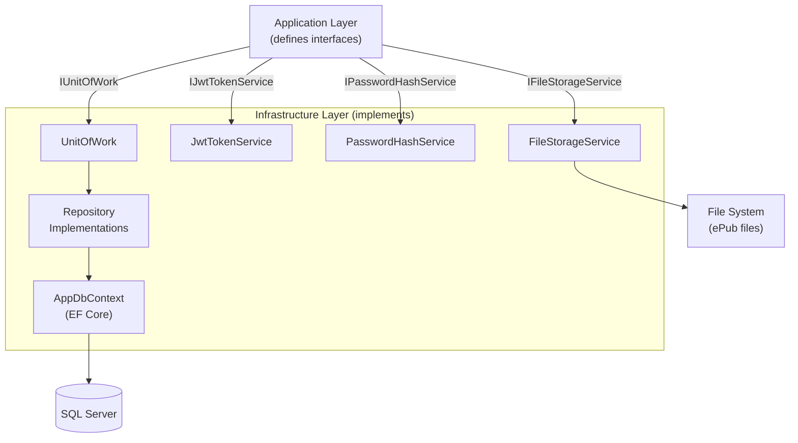

# Chapter 05 — Infrastructure Layer

> *"Infrastructure implements what Application requires. It knows about databases; Application doesn't."*

---

## Chapter Objectives

By the end of this chapter you will:
- Have EF Core configured with all entity type configurations (Fluent API)
- Have all repository implementations working
- Have the Unit of Work pattern implemented
- Have JWT token generation and BCrypt password hashing implemented
- Have the file storage service for ePub file management implemented
- Understand how to register all Infrastructure services in DI

---

## 5.1 What the Infrastructure Layer Does

Infrastructure is the only layer that touches **external systems**: the database, the file system, and cryptographic libraries.



---

## 5.2 AppDbContext — The EF Core Heart

**File:** `src/EBookLibrary.Infrastructure/Persistence/AppDbContext.cs`

```csharp
using EBookLibrary.Domain.Common;
using EBookLibrary.Domain.Entities;
using Microsoft.EntityFrameworkCore;

namespace EBookLibrary.Infrastructure.Persistence;

public class AppDbContext : DbContext
{
    public AppDbContext(DbContextOptions<AppDbContext> options) : base(options) { }

    // DbSets — one per entity that maps to a table
    public DbSet<Book> Books => Set<Book>();
    public DbSet<Author> Authors => Set<Author>();
    public DbSet<Genre> Genres => Set<Genre>();
    public DbSet<User> Users => Set<User>();
    public DbSet<BookAuthor> BookAuthors => Set<BookAuthor>();
    public DbSet<BookGenre> BookGenres => Set<BookGenre>();
    public DbSet<BookDownload> BookDownloads => Set<BookDownload>();

    protected override void OnModelCreating(ModelBuilder modelBuilder)
    {
        base.OnModelCreating(modelBuilder);

        // Apply all IEntityTypeConfiguration<T> classes defined in this assembly
        // This discovers BookConfiguration, AuthorConfiguration, etc. automatically
        modelBuilder.ApplyConfigurationsFromAssembly(typeof(AppDbContext).Assembly);

        // Global query filters — automatically exclude soft-deleted records
        // from ALL queries (unless you explicitly use .IgnoreQueryFilters())
        modelBuilder.Entity<Book>().HasQueryFilter(b => !b.IsDeleted);
        modelBuilder.Entity<Author>().HasQueryFilter(a => !a.IsDeleted);
        modelBuilder.Entity<Genre>().HasQueryFilter(g => !g.IsDeleted);
        modelBuilder.Entity<User>().HasQueryFilter(u => !u.IsDeleted);
    }

    public override Task<int> SaveChangesAsync(CancellationToken cancellationToken = default)
    {
        // Auto-set UpdatedAt for any entity that was modified
        foreach (var entry in ChangeTracker.Entries<BaseEntity>()
            .Where(e => e.State == EntityState.Modified))
        {
            entry.Entity.MarkAsUpdated();
        }
        return base.SaveChangesAsync(cancellationToken);
    }
}
```

### Why `ApplyConfigurationsFromAssembly`?

Instead of calling `modelBuilder.Entity<Book>()...` directly in `OnModelCreating` (which would make the method enormous), we use separate configuration classes. `ApplyConfigurationsFromAssembly` scans the assembly for all classes implementing `IEntityTypeConfiguration<T>` and applies them automatically.

---

## 5.3 Entity Configurations (Fluent API)

These classes define how domain entities map to database columns, with constraints, indexes, and relationships.

**File:** `src/EBookLibrary.Infrastructure/Persistence/Configurations/BookConfiguration.cs`

```csharp
using EBookLibrary.Domain.Entities;
using Microsoft.EntityFrameworkCore;
using Microsoft.EntityFrameworkCore.Metadata.Builders;

namespace EBookLibrary.Infrastructure.Persistence.Configurations;

public class BookConfiguration : IEntityTypeConfiguration<Book>
{
    public void Configure(EntityTypeBuilder<Book> builder)
    {
        builder.ToTable("Books");
        builder.HasKey(b => b.Id);

        builder.Property(b => b.Title)
            .IsRequired()
            .HasMaxLength(500);

        builder.Property(b => b.Isbn)
            .HasMaxLength(20);

        builder.Property(b => b.Description)
            .HasMaxLength(4000);

        builder.Property(b => b.FilePath)
            .HasMaxLength(1000);

        builder.Property(b => b.CoverImagePath)
            .HasMaxLength(1000);

        // Store enum as string for readability in DB (not integer)
        builder.Property(b => b.Language)
            .HasConversion<string>()
            .HasMaxLength(20);

        builder.Property(b => b.Status)
            .HasConversion<string>()
            .HasMaxLength(20);

        // Indexes for common query patterns
        builder.HasIndex(b => b.Title);
        builder.HasIndex(b => b.Status);
        builder.HasIndex(b => b.IsDeleted);

        // Unique index on ISBN (nullable — some books have no ISBN)
        builder.HasIndex(b => b.Isbn)
            .IsUnique()
            .HasFilter("[Isbn] IS NOT NULL");

        // Tell EF Core not to persist domain events (they're in-memory only)
        builder.Ignore(b => b.DomainEvents);
    }
}
```

**File:** `src/EBookLibrary.Infrastructure/Persistence/Configurations/UserConfiguration.cs`

```csharp
public class UserConfiguration : IEntityTypeConfiguration<User>
{
    public void Configure(EntityTypeBuilder<User> builder)
    {
        builder.ToTable("Users");
        builder.HasKey(u => u.Id);

        builder.Property(u => u.Email).IsRequired().HasMaxLength(256);
        builder.Property(u => u.PasswordHash).IsRequired().HasMaxLength(100);
        builder.Property(u => u.FirstName).HasMaxLength(100);
        builder.Property(u => u.LastName).HasMaxLength(100);

        builder.Property(u => u.Role)
            .HasConversion<string>()
            .HasMaxLength(20);

        // Unique index on email — enforced at DB level too
        builder.HasIndex(u => u.Email).IsUnique();
        builder.HasIndex(u => u.IsDeleted);

        builder.Ignore(u => u.DomainEvents);
    }
}
```

**File:** `src/EBookLibrary.Infrastructure/Persistence/Configurations/BookAuthorConfiguration.cs`

```csharp
public class BookAuthorConfiguration : IEntityTypeConfiguration<BookAuthor>
{
    public void Configure(EntityTypeBuilder<BookAuthor> builder)
    {
        builder.ToTable("BookAuthors");

        // Composite primary key for the join table
        builder.HasKey(ba => new { ba.BookId, ba.AuthorId });

        builder.HasOne(ba => ba.Book)
            .WithMany(b => b.BookAuthors)
            .HasForeignKey(ba => ba.BookId)
            .OnDelete(DeleteBehavior.Cascade);

        builder.HasOne(ba => ba.Author)
            .WithMany(a => a.BookAuthors)
            .HasForeignKey(ba => ba.AuthorId)
            .OnDelete(DeleteBehavior.Cascade);
    }
}
```

> **Pattern:** Join table configurations always use composite primary keys (`HasKey(x => new { x.BookId, x.AuthorId })`) and configure both sides of the relationship.

---

## 5.4 Generic Repository

**File:** `src/EBookLibrary.Infrastructure/Repositories/GenericRepository.cs`

```csharp
using EBookLibrary.Domain.Common;
using EBookLibrary.Domain.Interfaces.Repositories;
using Microsoft.EntityFrameworkCore;

namespace EBookLibrary.Infrastructure.Repositories;

public class GenericRepository<T> : IGenericRepository<T> where T : BaseEntity
{
    protected readonly AppDbContext _context;
    protected readonly DbSet<T> _dbSet;

    public GenericRepository(AppDbContext context)
    {
        _context = context;
        _dbSet = context.Set<T>();
    }

    public virtual async Task<T?> GetByIdAsync(Guid id, CancellationToken ct = default)
        => await _dbSet.FindAsync(new object[] { id }, ct);

    public virtual async Task<IEnumerable<T>> GetAllAsync(CancellationToken ct = default)
        => await _dbSet.ToListAsync(ct);

    public virtual async Task AddAsync(T entity, CancellationToken ct = default)
        => await _dbSet.AddAsync(entity, ct);

    public virtual void Update(T entity)
        => _dbSet.Update(entity);

    // Soft delete — sets IsDeleted = true, does NOT remove the row
    public virtual void Delete(T entity)
        => entity.SoftDelete();

    public virtual async Task<bool> ExistsAsync(Guid id, CancellationToken ct = default)
        => await _dbSet.AnyAsync(e => e.Id == id, ct);
}
```

### Book Repository (Specialization)

**File:** `src/EBookLibrary.Infrastructure/Repositories/BookRepository.cs`

```csharp
using EBookLibrary.Domain.Entities;
using EBookLibrary.Domain.Interfaces.Repositories;
using Microsoft.EntityFrameworkCore;

namespace EBookLibrary.Infrastructure.Repositories;

public class BookRepository : GenericRepository<Book>, IBookRepository
{
    public BookRepository(AppDbContext context) : base(context) { }

    public async Task<Book?> GetByIdWithDetailsAsync(Guid id, CancellationToken ct = default)
        => await _context.Books
            .Include(b => b.BookAuthors).ThenInclude(ba => ba.Author)
            .Include(b => b.BookGenres).ThenInclude(bg => bg.Genre)
            .FirstOrDefaultAsync(b => b.Id == id, ct);

    public async Task<(IEnumerable<Book> Items, int TotalCount)> SearchAsync(
        string? title, string? authorName, string? genreName,
        int? publicationYear, int pageNumber, int pageSize,
        CancellationToken ct = default)
    {
        var query = _context.Books
            .Include(b => b.BookAuthors).ThenInclude(ba => ba.Author)
            .Include(b => b.BookGenres).ThenInclude(bg => bg.Genre)
            .AsQueryable();

        if (!string.IsNullOrWhiteSpace(title))
            query = query.Where(b => b.Title.Contains(title));

        if (!string.IsNullOrWhiteSpace(authorName))
            query = query.Where(b => b.BookAuthors
                .Any(ba => ba.Author.Name.Contains(authorName)));

        if (!string.IsNullOrWhiteSpace(genreName))
            query = query.Where(b => b.BookGenres
                .Any(bg => bg.Genre.Name.Contains(genreName)));

        if (publicationYear.HasValue)
            query = query.Where(b => b.PublicationYear == publicationYear);

        var totalCount = await query.CountAsync(ct);

        var items = await query
            .OrderBy(b => b.Title)
            .Skip((pageNumber - 1) * pageSize)
            .Take(pageSize)
            .ToListAsync(ct);

        return (items, totalCount);
    }

    public async Task<Book?> GetByIsbnAsync(string isbn, CancellationToken ct = default)
        => await _dbSet.FirstOrDefaultAsync(b => b.Isbn == isbn, ct);

    public async Task<(IEnumerable<Book> Items, int TotalCount)> GetPagedAsync(
        int pageNumber, int pageSize, CancellationToken ct = default)
    {
        var total = await _dbSet.CountAsync(ct);
        var items = await _dbSet
            .Include(b => b.BookAuthors).ThenInclude(ba => ba.Author)
            .Include(b => b.BookGenres).ThenInclude(bg => bg.Genre)
            .OrderBy(b => b.Title)
            .Skip((pageNumber - 1) * pageSize)
            .Take(pageSize)
            .ToListAsync(ct);
        return (items, total);
    }
}
```

---

## 5.5 Unit of Work

**File:** `src/EBookLibrary.Infrastructure/Persistence/UnitOfWork.cs`

```csharp
using EBookLibrary.Domain.Interfaces.Repositories;

namespace EBookLibrary.Infrastructure.Persistence;

public class UnitOfWork : IUnitOfWork
{
    private readonly AppDbContext _context;

    public IBookRepository Books { get; }
    public IAuthorRepository Authors { get; }
    public IGenreRepository Genres { get; }
    public IUserRepository Users { get; }
    public IBookDownloadRepository BookDownloads { get; }

    public UnitOfWork(
        AppDbContext context,
        IBookRepository books,
        IAuthorRepository authors,
        IGenreRepository genres,
        IUserRepository users,
        IBookDownloadRepository bookDownloads)
    {
        _context = context;
        Books = books;
        Authors = authors;
        Genres = genres;
        Users = users;
        BookDownloads = bookDownloads;
    }

    public async Task<int> SaveChangesAsync(CancellationToken ct = default)
        => await _context.SaveChangesAsync(ct);

    public void Dispose()
        => _context.Dispose();
}
```

---

## 5.6 JWT Token Service

**File:** `src/EBookLibrary.Infrastructure/Services/JwtTokenService.cs`

```csharp
using System.IdentityModel.Tokens.Jwt;
using System.Security.Claims;
using System.Text;
using Microsoft.Extensions.Options;
using Microsoft.IdentityModel.Tokens;

namespace EBookLibrary.Infrastructure.Services;

public class JwtTokenService : IJwtTokenService
{
    private readonly JwtSettings _settings;

    public JwtTokenService(IOptions<JwtSettings> settings)
        => _settings = settings.Value;

    public string GenerateToken(Guid userId, string email, string role)
    {
        var key = new SymmetricSecurityKey(Encoding.UTF8.GetBytes(_settings.SecretKey));
        var credentials = new SigningCredentials(key, SecurityAlgorithms.HmacSha256);

        // CRITICAL: Use ClaimTypes.Role (not a custom "role" claim)
        // ASP.NET Core's [Authorize(Roles = "Admin")] reads ClaimTypes.Role
        var claims = new[]
        {
            new Claim(JwtRegisteredClaimNames.Sub, userId.ToString()),
            new Claim(JwtRegisteredClaimNames.Email, email),
            new Claim(ClaimTypes.Role, role),
            new Claim(JwtRegisteredClaimNames.Jti, Guid.NewGuid().ToString()),
            new Claim(JwtRegisteredClaimNames.Iat,
                DateTimeOffset.UtcNow.ToUnixTimeSeconds().ToString(),
                ClaimValueTypes.Integer64)
        };

        var token = new JwtSecurityToken(
            issuer: _settings.Issuer,
            audience: _settings.Audience,
            claims: claims,
            expires: DateTime.UtcNow.AddMinutes(_settings.ExpiryInMinutes),
            signingCredentials: credentials);

        return new JwtSecurityTokenHandler().WriteToken(token);
    }

    public bool ValidateToken(string token, out Guid userId)
    {
        userId = Guid.Empty;
        try
        {
            var key = new SymmetricSecurityKey(Encoding.UTF8.GetBytes(_settings.SecretKey));
            var handler = new JwtSecurityTokenHandler();
            var principal = handler.ValidateToken(token, new TokenValidationParameters
            {
                ValidateIssuerSigningKey = true,
                IssuerSigningKey = key,
                ValidateIssuer = true,
                ValidIssuer = _settings.Issuer,
                ValidateAudience = true,
                ValidAudience = _settings.Audience,
                ValidateLifetime = true,
                ClockSkew = TimeSpan.Zero  // No tolerance for expired tokens
            }, out _);

            var sub = principal.FindFirst(JwtRegisteredClaimNames.Sub)?.Value;
            return sub is not null && Guid.TryParse(sub, out userId);
        }
        catch
        {
            return false;
        }
    }
}
```

**File:** `src/EBookLibrary.Infrastructure/Services/JwtSettings.cs`

```csharp
namespace EBookLibrary.Infrastructure.Services;

public class JwtSettings
{
    public string SecretKey { get; init; } = string.Empty;
    public string Issuer { get; init; } = string.Empty;
    public string Audience { get; init; } = string.Empty;
    public int ExpiryInMinutes { get; init; } = 60;
}
```

---

## 5.7 Password Hash Service

**File:** `src/EBookLibrary.Infrastructure/Services/PasswordHashService.cs`

```csharp
namespace EBookLibrary.Infrastructure.Services;

public class PasswordHashService : IPasswordHashService
{
    // Work factor 12: roughly 250ms per hash on modern hardware
    // High enough to resist brute force, low enough for user experience
    private const int WorkFactor = 12;

    public string HashPassword(string plainText)
        => BCrypt.Net.BCrypt.HashPassword(plainText, WorkFactor);

    public bool VerifyPassword(string plainText, string hash)
        => BCrypt.Net.BCrypt.Verify(plainText, hash);
}
```

> **Why BCrypt with work factor 12?** BCrypt is deliberately slow — that's the point. A work factor of 12 means generating a hash takes ~250ms on modern hardware. This makes brute-force attacks extremely time-consuming (trying a million passwords would take ~70 hours per thread). The work factor can be increased as hardware gets faster.

---

## 5.8 File Storage Service

**File:** `src/EBookLibrary.Infrastructure/Services/FileStorageService.cs`

```csharp
using Microsoft.Extensions.Options;

namespace EBookLibrary.Infrastructure.Services;

public class FileStorageService : IFileStorageService
{
    private readonly FileStorageSettings _settings;

    public FileStorageService(IOptions<FileStorageSettings> settings)
        => _settings = settings.Value;

    public async Task<string> SaveBookFileAsync(
        Stream fileStream, string originalFileName, string genreName, CancellationToken ct = default)
    {
        // Sanitize genre name for use as folder name
        var safeFolderName = SanitizeFolderName(genreName);
        var genreFolder = Path.Combine(_settings.BasePath, safeFolderName);
        Directory.CreateDirectory(genreFolder);

        // Generate a unique filename to prevent collisions
        var extension = Path.GetExtension(originalFileName).ToLowerInvariant();
        if (!_settings.AllowedExtensions.Contains(extension))
            throw new InvalidOperationException($"File type '{extension}' is not allowed.");

        var uniqueFileName = $"{Guid.NewGuid()}{extension}";
        var absolutePath = Path.Combine(genreFolder, uniqueFileName);

        await using var fileStreamOutput = File.Create(absolutePath);
        await fileStream.CopyToAsync(fileStreamOutput, ct);

        // Return relative path (stored in DB, not the absolute path)
        return Path.Combine(safeFolderName, uniqueFileName);
    }

    public string GetAbsolutePath(string relativePath)
        => Path.Combine(_settings.BasePath, relativePath);

    public bool FileExists(string relativePath)
        => File.Exists(GetAbsolutePath(relativePath));

    public async Task DeleteFileAsync(string relativePath, CancellationToken ct = default)
    {
        var absolutePath = GetAbsolutePath(relativePath);
        if (File.Exists(absolutePath))
            await Task.Run(() => File.Delete(absolutePath), ct);
    }

    private static string SanitizeFolderName(string name)
        => string.Concat(name.Where(c => char.IsLetterOrDigit(c) || c == '-' || c == '_'));
}
```

**File:** `src/EBookLibrary.Infrastructure/Services/FileStorageSettings.cs`

```csharp
namespace EBookLibrary.Infrastructure.Services;

public class FileStorageSettings
{
    public string BasePath { get; init; } = string.Empty;
    public string[] AllowedExtensions { get; init; } = [".epub"];
    public long MaxFileSizeBytes { get; init; } = 50 * 1024 * 1024; // 50 MB
}
```

---

## 5.9 Current User Service

**File:** `src/EBookLibrary.Infrastructure/Services/CurrentUserService.cs`

```csharp
using System.IdentityModel.Tokens.Jwt;
using System.Security.Claims;
using Microsoft.AspNetCore.Http;

namespace EBookLibrary.Infrastructure.Services;

public class CurrentUserService : ICurrentUserService
{
    private readonly IHttpContextAccessor _httpContextAccessor;

    public CurrentUserService(IHttpContextAccessor httpContextAccessor)
        => _httpContextAccessor = httpContextAccessor;

    private ClaimsPrincipal? User => _httpContextAccessor.HttpContext?.User;

    public Guid? UserId
    {
        get
        {
            var sub = User?.FindFirst(JwtRegisteredClaimNames.Sub)?.Value
                      ?? User?.FindFirst(ClaimTypes.NameIdentifier)?.Value;
            return Guid.TryParse(sub, out var id) ? id : null;
        }
    }

    public string? Email => User?.FindFirst(JwtRegisteredClaimNames.Email)?.Value
                            ?? User?.FindFirst(ClaimTypes.Email)?.Value;

    public string? Role => User?.FindFirst(ClaimTypes.Role)?.Value;

    public bool IsAuthenticated => User?.Identity?.IsAuthenticated ?? false;

    public bool IsAdmin => Role == "Admin";
}
```

---

## 5.10 Dependency Injection Registration

**File:** `src/EBookLibrary.Infrastructure/DependencyInjection.cs`

```csharp
using Microsoft.EntityFrameworkCore;
using Microsoft.Extensions.Configuration;
using Microsoft.Extensions.DependencyInjection;

namespace EBookLibrary.Infrastructure;

public static class DependencyInjection
{
    public static IServiceCollection AddInfrastructure(
        this IServiceCollection services, IConfiguration configuration)
    {
        // EF Core — the ONLY place that references SQL Server
        services.AddDbContext<AppDbContext>(options =>
            options.UseSqlServer(
                configuration.GetConnectionString("DefaultConnection"),
                b => b.MigrationsAssembly(typeof(AppDbContext).Assembly.FullName)));

        // Repositories
        services.AddScoped<IBookRepository, BookRepository>();
        services.AddScoped<IAuthorRepository, AuthorRepository>();
        services.AddScoped<IGenreRepository, GenreRepository>();
        services.AddScoped<IUserRepository, UserRepository>();
        services.AddScoped<IBookDownloadRepository, BookDownloadRepository>();
        services.AddScoped<IUnitOfWork, UnitOfWork>();

        // Services
        services.Configure<JwtSettings>(configuration.GetSection("JwtSettings"));
        services.Configure<FileStorageSettings>(configuration.GetSection("FileStorage"));
        services.AddScoped<IJwtTokenService, JwtTokenService>();
        services.AddScoped<IPasswordHashService, PasswordHashService>();
        services.AddScoped<IFileStorageService, FileStorageService>();
        services.AddHttpContextAccessor();
        services.AddScoped<ICurrentUserService, CurrentUserService>();

        return services;
    }
}
```

---

## 5.11 Checkpoint ✅

The Infrastructure layer is complete when:

- [ ] `AppDbContext` exists with all 7 `DbSet<T>` properties
- [ ] Global query filters for soft delete are applied in `OnModelCreating`
- [ ] At least `BookConfiguration` and `UserConfiguration` exist as `IEntityTypeConfiguration<T>`
- [ ] `GenericRepository<T>` base class implements `IGenericRepository<T>`
- [ ] `BookRepository` overrides `SearchAsync` with filtering and pagination
- [ ] `UnitOfWork` aggregates all repositories
- [ ] `JwtTokenService` uses `ClaimTypes.Role` (not a custom claim name)
- [ ] `PasswordHashService` uses BCrypt work factor 12
- [ ] `FileStorageService` validates file extensions before saving
- [ ] `DependencyInjection.cs` registers everything
- [ ] `dotnet build src/EBookLibrary.Infrastructure` — 0 errors

---

## 5.12 🤖 AI-Assisted Development — Infrastructure Layer

**What Copilot generated well:**
- `GenericRepository<T>` pattern with correct soft-delete implementation
- Entity configuration classes for most entities
- `JwtTokenService` structure (though the claims needed correction)

**What required correction:**
- Initial `JwtTokenService` used `"role"` as the claim name instead of `ClaimTypes.Role`. This would have caused `[Authorize(Roles = "Admin")]` to fail silently — the token was valid, but role-based authorization didn't work.
- `FileStorageService` initially stored absolute paths in the database — corrected to store relative paths for portability.
- `CurrentUserService` initially only checked `ClaimTypes.NameIdentifier` but not `JwtRegisteredClaimNames.Sub`. Fixed to check both.

> **Key lesson:** Always test authentication end-to-end after generation. Claims mapping issues are invisible until you make a protected request.

---

## Further Reading

- [docs/04-INFRASTRUCTURE-LAYER.md](../docs/04-INFRASTRUCTURE-LAYER.md) — Original infrastructure layer prompt
- EF Core Fluent API: https://docs.microsoft.com/ef/core/modeling/
- BCrypt.Net documentation: https://github.com/BcryptNet/bcrypt.net

---

**← Previous:** [04 — Application Layer](04-APPLICATION-LAYER.md)  
**Next →** [06 — Web API Layer](06-WEBAPI-LAYER.md)
