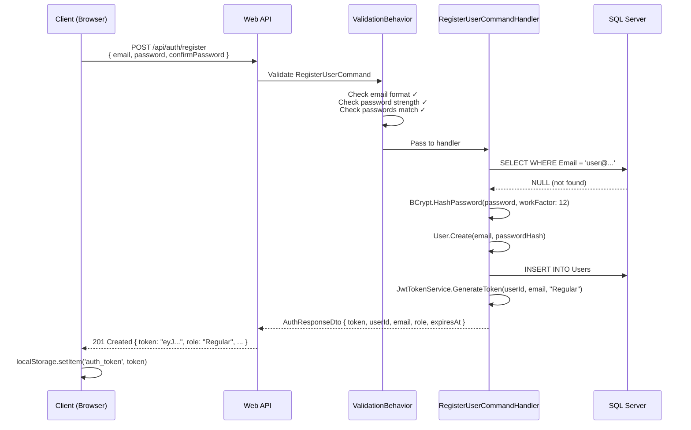
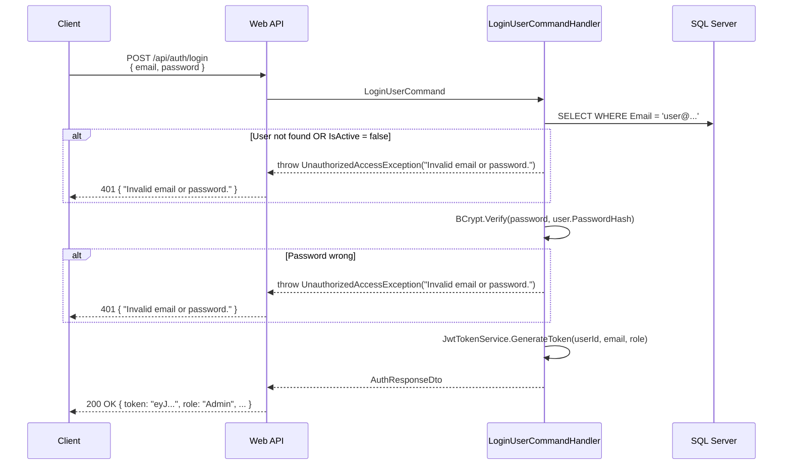
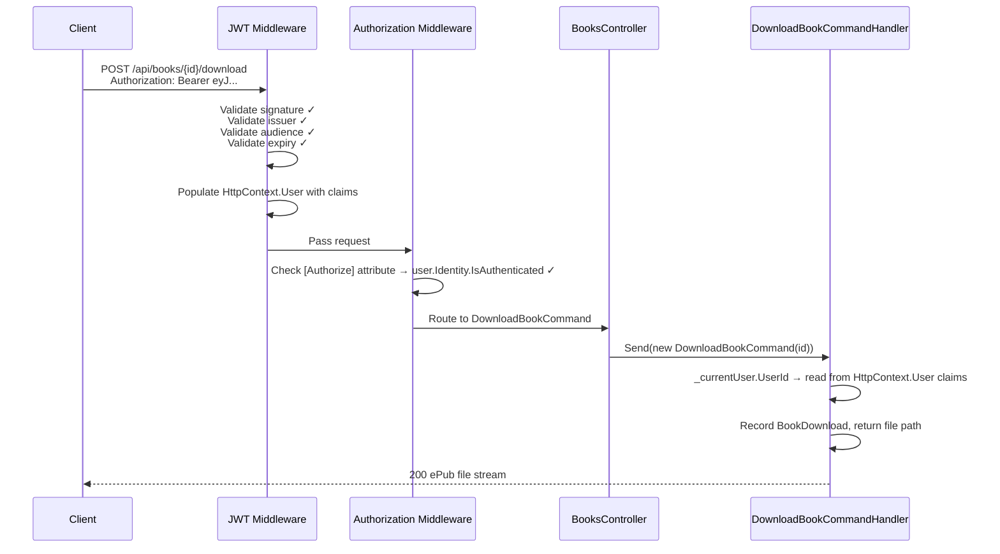

# Chapter 07 — Authentication Deep Dive

> *"Security is not a feature you add at the end. It's a property you design from the start."*

---

## Chapter Objectives

By the end of this chapter you will:
- Understand the complete JWT authentication flow in this application
- Know the exact claims structure in the token and why each claim matters
- Be able to trace an authenticated request from browser to database
- Understand BCrypt and why it's the right choice for password hashing
- Know the security trade-offs made in v1 and how to improve them

---

## 7.1 What is JWT Authentication?

**JSON Web Tokens (JWT)** are a compact, URL-safe way to represent claims between two parties. In EBook Library, JWTs serve as **proof of identity** — after logging in, the server issues a token that the client presents with every subsequent request.

### JWT Structure

A JWT consists of three Base64URL-encoded parts separated by dots:

```
eyJhbGciOiJIUzI1NiJ9   .   eyJzdWIiOiIxMjM0..."}   .   SflKxwRJSMeKKF2QT4
└──────────────────────┘   └──────────────────────────┘   └─────────────────┘
        Header                       Payload                   Signature
     (algorithm)                    (claims)              (HMAC-SHA256 hash)
```

**Header** — declares the algorithm:
```json
{ "alg": "HS256", "typ": "JWT" }
```

**Payload** — the claims (user data):
```json
{
  "sub": "3fa85f64-5717-4562-b3fc-2c963f66afa6",
  "email": "admin@ebooklibrary.com",
  "role": "Admin",
  "jti": "a1b2c3d4-...",
  "iat": 1745000000,
  "exp": 1745003600,
  "iss": "EBookLibrary",
  "aud": "EBookLibraryUsers"
}
```

**Signature** — HMAC-SHA256 of `header.payload` using the server's secret key. If anyone tampers with the payload, the signature won't match, and the server rejects the token.

### Why Stateless?

The server **never stores JWT tokens**. Verification is purely mathematical:
1. Server receives token
2. Recalculates the signature using its secret key
3. Compares calculated signature with the token's signature
4. If they match → token is valid and unmodified

This means no session database, no Redis cache for sessions, no server-side state. Every server in a cluster can validate any token independently.

---

## 7.2 Authentication Flow

### Registration Flow



### Login Flow



### Protected Endpoint Flow



---

## 7.3 JWT Claims — Why Each Matters

| Claim | Standard Name | Value in EBook Library | Why It Matters |
|---|---|---|---|
| Subject | `sub` | User GUID (e.g., `3fa85f64-...`) | Identifies the user uniquely |
| Email | `email` | User's email address | Shown in profile UI |
| Role | `ClaimTypes.Role` | `"Regular"` or `"Admin"` | Used by `[Authorize(Roles = "Admin")]` |
| JWT ID | `jti` | New GUID per token | Enables future token revocation (add to a blocklist) |
| Issued At | `iat` | Unix timestamp | Audit trail |
| Expiry | `exp` | `iat + 3600` (1 hour) | Enforces token lifetime |
| Issuer | `iss` | `"EBookLibrary"` | Validates tokens come from this server |
| Audience | `aud` | `"EBookLibraryUsers"` | Validates tokens are meant for this application |

### The Role Claim — Critical Detail

There are two ways to add a role claim to a JWT:

```csharp
// ❌ Wrong: Custom claim name "role" — [Authorize(Roles = "Admin")] won't work
new Claim("role", role)

// ✅ Correct: ClaimTypes.Role — [Authorize(Roles = "Admin")] reads this
new Claim(ClaimTypes.Role, role)
```

`ClaimTypes.Role` resolves to `"http://schemas.microsoft.com/ws/2008/06/identity/claims/role"`. ASP.NET Core's role authorization specifically looks for this claim type. Using a plain `"role"` string fails silently — the token is valid, but admin endpoints return 403.

---

## 7.4 BCrypt Password Hashing

**File reference:** `src/EBookLibrary.Infrastructure/Services/PasswordHashService.cs`

### Why BCrypt?

Password hashing requirements:
1. **One-way** — cannot be reversed
2. **Salted** — same password hashes differently each time (prevents rainbow table attacks)
3. **Slow** — deliberately expensive to compute (resists brute force)

BCrypt satisfies all three. The work factor controls the cost:

| Work Factor | Hash Time (modern CPU) | Brute Force Rate |
|---|---|---|
| 10 | ~100ms | ~10 hashes/second/thread |
| 12 (used here) | ~250ms | ~4 hashes/second/thread |
| 14 | ~1 second | ~1 hash/second/thread |

With work factor 12, an attacker trying 1 million passwords would need ~70 hours per thread. Increase the work factor as hardware improves.

### BCrypt Salt

```csharp
BCrypt.HashPassword("password123", workFactor: 12)
// Returns: "$2a$12$N9qo8uLOickgx2ZMRZoMyeIjZAgcfl7p92ldGxad68LJZdL17lhWy"
//              ^^^  ^^^^^
//         version workfactor  <- embedded in the hash
```

The salt is embedded in the hash output — you don't need to store it separately. This is why BCrypt verification is simply `BCrypt.Verify(plainText, storedHash)`.

---

## 7.5 Role-Based Authorization

The application has two roles: `Regular` and `Admin`. Authorization is enforced via attributes:

```csharp
// Anyone authenticated can access
[Authorize]
public IActionResult GetProfile() { ... }

// Only users with Role = "Admin" can access
[Authorize(Roles = "Admin")]
public IActionResult CreateBook() { ... }

// No authentication required (overrides [Authorize] on the class)
[AllowAnonymous]
public IActionResult SearchBooks() { ... }
```

### Class-level vs Method-level

The `BooksController` uses this pattern:

```csharp
[Authorize]                          // Default: all actions require auth
public class BooksController : ApiControllerBase
{
    [AllowAnonymous]                  // Override: anyone can search
    public IActionResult Search() { ... }

    [AllowAnonymous]                  // Override: anyone can view details
    public IActionResult GetById() { ... }

    // No attribute = inherits [Authorize] from class
    public IActionResult Download() { ... }

    [Authorize(Roles = "Admin")]      // Override: admin only
    public IActionResult Create() { ... }
}
```

---

## 7.6 Security Hardening Checklist

The following security measures are implemented in this project:

| Measure | Implementation | Location |
|---|---|---|
| Password hashing | BCrypt work factor 12 | `PasswordHashService` |
| Stateless tokens | JWT (no server sessions) | `JwtTokenService` |
| Token expiry | 60 minutes (configurable) | `appsettings.json` |
| Role-based access | `[Authorize(Roles = "Admin")]` | All admin endpoints |
| Same error messages | Login/not-found → identical 401 | `LoginUserCommandHandler` |
| Input validation | FluentValidation in pipeline | `ValidationBehavior` |
| Global error handling | No stack traces exposed | `ExceptionHandlingMiddleware` |
| CORS lockdown | Only named origins allowed | `Program.cs` CORS policy |
| HTTPS enforcement | `UseHttpsRedirection()` | `Program.cs` |
| File type validation | Only `.epub` allowed | `FileStorageService` |
| File size limits | 50MB max via `[RequestSizeLimit]` | `FilesController` |

### Known Trade-offs (v1 Decisions)

| Trade-off | v1 Decision | Recommended v2 Improvement |
|---|---|---|
| Token storage | `localStorage` (vulnerable to XSS) | `httpOnly` cookies + CSRF tokens |
| No refresh tokens | Token expires, user must re-login | Refresh token rotation |
| No token revocation | Logout doesn't truly invalidate token | Redis blocklist using `jti` claim |
| No rate limiting on login | Brute force possible | `AspNetCoreRateLimit` middleware |
| Secret in appsettings | Dev convenience | Azure Key Vault / environment variables in production |

---

## 7.7 Testing Authentication

Use the `.http` file or Postman collection to test the full auth flow:

```http
### Register
POST https://localhost:7xxx/api/auth/register
Content-Type: application/json

{
  "email": "testuser@example.com",
  "password": "TestPass1!",
  "confirmPassword": "TestPass1!"
}

### Login
POST https://localhost:7xxx/api/auth/login
Content-Type: application/json

{
  "email": "testuser@example.com",
  "password": "TestPass1!"
}

### Use token
GET https://localhost:7xxx/api/books/search?title=cervantes
Authorization: Bearer {{token}}
```

Decode your JWT token at https://jwt.io to inspect the claims. Verify that:
- `sub` is a valid GUID
- `role` uses the full `ClaimTypes.Role` URI form
- `exp` is roughly 1 hour from `iat`

---

## 7.8 Checkpoint ✅

Authentication is complete when:

- [ ] `POST /api/auth/register` returns a 201 with a valid JWT token
- [ ] `POST /api/auth/login` with correct credentials returns 200 + token
- [ ] `POST /api/auth/login` with wrong password returns 401 (not 403 or 404)
- [ ] `GET /api/books/search` works without a token (anonymous)
- [ ] `POST /api/books/{id}/download` returns 401 without a token
- [ ] `POST /api/books/{id}/download` succeeds with a Regular user token
- [ ] `POST /api/books` returns 403 with a Regular user token (admin endpoint)
- [ ] `POST /api/books` succeeds with an Admin user token
- [ ] JWT decoded at jwt.io shows correct claims and expiry

---

## 7.9 🤖 AI-Assisted Development — Authentication

**What Copilot generated correctly:**
- BCrypt integration with correct work factor
- JWT token generation structure
- FluentValidation password strength rules

**What required correction:**
- **ClaimTypes.Role vs. "role" string** — this is the single most common AI mistake in .NET JWT implementations. Every AI model tested initially generated `new Claim("role", role)` instead of `new Claim(ClaimTypes.Role, role)`. Always verify this manually.
- Error message consistency — initial handlers returned different messages for "not found" and "wrong password". Fixed to prevent user enumeration.

> **Lesson:** Authentication code generated by AI must be reviewed line-by-line. The bugs are subtle — the code compiles and even works for basic cases, but fails under security analysis.

---

## Further Reading

- [docs/06-AUTHENTICATION.md](../docs/06-AUTHENTICATION.md) — Original authentication prompt document
- JWT.io — decode and inspect any JWT token: https://jwt.io
- OWASP Authentication Cheat Sheet: https://cheatsheetseries.owasp.org/cheatsheets/Authentication_Cheat_Sheet.html
- BCrypt cost factor guidance: https://auth0.com/blog/hashing-in-action-understanding-bcrypt/

---

**← Previous:** [06 — Web API Layer](06-WEBAPI-LAYER.md)  
**Next →** [08 — Database & Migrations](08-DATABASE-MIGRATIONS.md)
