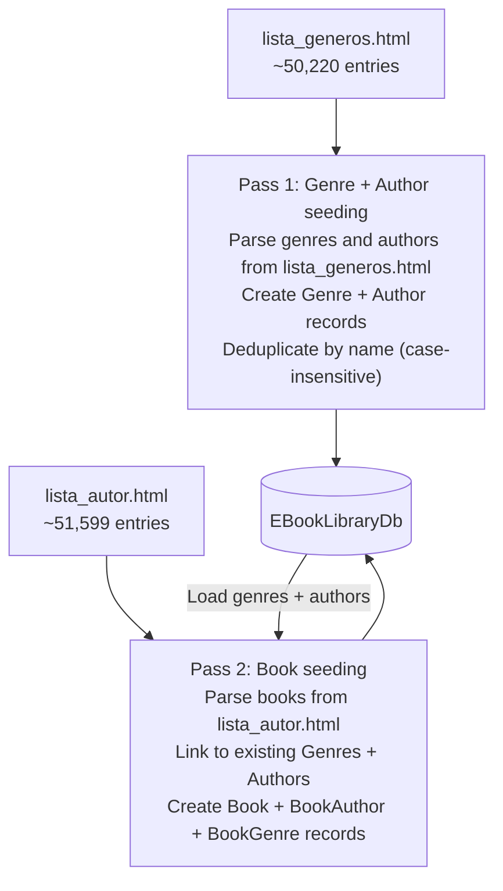

# Chapter 08 — Database Setup & Migrations

> *"The database is a detail. But a detail that must be precisely configured to hold your data."*

---

## Chapter Objectives

By the end of this chapter you will:
- Have EF Core migrations created and applied to SQL Server
- Understand the expected database schema with all 7 tables
- Have the `EBookLibrary.Seeder` console project seeding 51,599 books from HTML source files
- Know how to handle common migration and seeding failures

---

## 8.1 Prerequisites

Before running migrations, verify:
```bash
# SQL Server is running
Get-Service -Name "MSSQLSERVER" | Select-Object Name, Status

# EF Core tools installed
dotnet ef --version
# Should output: Entity Framework Core .NET Command-line Tools 10.x.x
```

If EF tools are not installed:
```bash
dotnet tool install --global dotnet-ef
```

---

## 8.2 Connection String Configuration

### Trusted Connection (Windows Authentication — recommended for development)

```json
{
  "ConnectionStrings": {
    "DefaultConnection": "Server=localhost;Database=EBookLibraryDb;Trusted_Connection=True;TrustServerCertificate=True;MultipleActiveResultSets=True"
  }
}
```

### SQL Authentication (if Windows auth is not available)

```json
{
  "ConnectionStrings": {
    "DefaultConnection": "Server=localhost;Database=EBookLibraryDb;User Id=sa;Password=YourPasswordHere;TrustServerCertificate=True;MultipleActiveResultSets=True"
  }
}
```

> **Note:** `TrustServerCertificate=True` is required in development with a local SQL Server that uses a self-signed certificate. Do not use this setting in production.

> **Note:** `MultipleActiveResultSets=True` is required when EF Core executes multiple parallel queries on the same connection, which can happen with `async` LINQ operations.

---

## 8.3 Create the Initial Migration

Run all migration commands from the **solution root** directory (where `EBookLibrary.sln` lives):

```bash
dotnet ef migrations add InitialCreate \
  --project src/EBookLibrary.Infrastructure \
  --startup-project src/EBookLibrary.WebApi \
  --output-dir Persistence/Migrations
```

**What each flag means:**
- `--project` — the project that contains `AppDbContext` (Infrastructure)
- `--startup-project` — the project with `Program.cs` (WebApi) — EF uses its `IConfiguration` to read connection strings
- `--output-dir` — where to generate migration files inside the Infrastructure project

**Generated files** in `src/EBookLibrary.Infrastructure/Persistence/Migrations/`:
```
YYYYMMDDHHMMSS_InitialCreate.cs            ← The migration (Up + Down methods)
YYYYMMDDHHMMSS_InitialCreate.Designer.cs  ← Metadata snapshot
AppDbContextModelSnapshot.cs              ← Current model state
```

### What the Migration Creates

The `Up()` method creates all tables with:
- Correct data types for each column
- Primary key constraints (all `Id` columns — Guid)
- Foreign key constraints (with cascade delete where configured)
- Unique indexes (email, ISBN)
- Standard indexes (Title, Status, IsDeleted — for query performance)

---

## 8.4 Apply the Migration

```bash
dotnet ef database update \
  --project src/EBookLibrary.Infrastructure \
  --startup-project src/EBookLibrary.WebApi
```

If the database `EBookLibraryDb` doesn't exist, this command creates it and applies all pending migrations.

---

## 8.5 Expected Database Schema

After migration, your database should have these tables:

```mermaid
erDiagram
    Users {
        uniqueidentifier Id PK
        nvarchar_256 Email UK
        nvarchar_100 PasswordHash
        nvarchar_100 FirstName NULL
        nvarchar_100 LastName NULL
        nvarchar_20 Role
        bit IsActive
        bit IsDeleted
        datetime2 CreatedAt
        datetime2 UpdatedAt NULL
    }

    Books {
        uniqueidentifier Id PK
        nvarchar_500 Title
        nvarchar_20 Isbn NULL UK
        nvarchar_4000 Description NULL
        int Pages
        int PublicationYear NULL
        nvarchar_1000 FilePath NULL
        nvarchar_1000 CoverImagePath NULL
        nvarchar_20 Language
        nvarchar_20 Status
        bit IsDeleted
        datetime2 CreatedAt
        datetime2 UpdatedAt NULL
    }

    Authors {
        uniqueidentifier Id PK
        nvarchar_300 Name
        nvarchar_2000 Biography NULL
        bit IsDeleted
        datetime2 CreatedAt
        datetime2 UpdatedAt NULL
    }

    Genres {
        uniqueidentifier Id PK
        nvarchar_100 Name UK
        nvarchar_500 Description NULL
        bit IsDeleted
        datetime2 CreatedAt
        datetime2 UpdatedAt NULL
    }

    BookAuthors {
        uniqueidentifier BookId FK
        uniqueidentifier AuthorId FK
    }

    BookGenres {
        uniqueidentifier BookId FK
        uniqueidentifier GenreId FK
    }

    BookDownloads {
        uniqueidentifier Id PK
        uniqueidentifier UserId FK
        uniqueidentifier BookId FK
        datetime2 DownloadedAt
    }

    __EFMigrationsHistory {
        nvarchar_150 MigrationId PK
        nvarchar_32 ProductVersion
    }

    Users ||--o{ BookDownloads : "has"
    Books ||--o{ BookDownloads : "tracked by"
    Books ||--o{ BookAuthors : "written by"
    Books ||--o{ BookGenres : "categorized in"
    Authors ||--o{ BookAuthors : "wrote"
    Genres ||--o{ BookGenres : "contains"
```

Verify in SSMS or Azure Data Studio:
```sql
USE EBookLibraryDb;
SELECT TABLE_NAME FROM INFORMATION_SCHEMA.TABLES ORDER BY TABLE_NAME;
-- Expected: 8 tables (7 domain tables + __EFMigrationsHistory)
```

---

## 8.6 The Data Seeder

The book catalog contains ~51,599 Spanish-language books across 128 genres, sourced from three HTML export files:
- `lista_autor.html` — 51,599 books sorted by author
- `lista_generos.html` — same books grouped by 128 genres
- `lista_titulo.html` — books sorted by title (reference only)

The `EBookLibrary.Seeder` console project parses these HTML files and inserts data in two passes.

### Seeder Architecture



### Pass 1: Seed Genres and Authors

```csharp
// Pseudocode for Pass 1
var html = File.ReadAllText("lista_generos.html");
var doc = new HtmlDocument(); // HtmlAgilityPack
doc.LoadHtml(html);

var genreNodes = doc.DocumentNode.SelectNodes("//h2[@class='genre-title']");
foreach (var genreNode in genreNodes)
{
    var genreName = genreNode.InnerText.Trim();
    if (!existingGenres.ContainsKey(genreName.ToLower()))
    {
        var genre = Genre.Create(genreName);
        context.Genres.Add(genre);
        existingGenres[genreName.ToLower()] = genre;
    }

    // Authors under this genre
    var authorNodes = genreNode.SelectNodes("following-sibling::table[1]//td[@class='author']");
    foreach (var authorNode in authorNodes)
    {
        var authorName = authorNode.InnerText.Trim();
        if (!existingAuthors.ContainsKey(authorName.ToLower()))
        {
            var author = Author.Create(authorName);
            context.Authors.Add(author);
            existingAuthors[authorName.ToLower()] = author;
        }
    }
}
await context.SaveChangesAsync();
```

### Pass 2: Seed Books

```csharp
// Pseudocode for Pass 2
var html = File.ReadAllText("lista_autor.html");
// Parse each book entry:
//   <tr><td>AUTHOR NAME</td><td>BOOK TITLE</td><td>GENRE</td><td>PAGES</td></tr>

foreach (var row in bookRows)
{
    var title = row.Cells[1].InnerText.Trim();
    var authorName = row.Cells[0].InnerText.Trim();
    var genreName = row.Cells[2].InnerText.Trim();
    var pages = int.TryParse(row.Cells[3].InnerText, out var p) ? p : 0;

    var book = Book.Create(title, BookLanguage.Spanish, pages: pages);

    // Link to existing author (created in Pass 1)
    if (existingAuthors.TryGetValue(authorName.ToLower(), out var author))
        book.BookAuthors.Add(BookAuthor.Create(book.Id, author.Id));

    // Link to existing genre (created in Pass 1)
    if (existingGenres.TryGetValue(genreName.ToLower(), out var genre))
        book.BookGenres.Add(BookGenre.Create(book.Id, genre.Id));

    context.Books.Add(book);
}

// Batch save in chunks of 500 to avoid memory issues
await context.SaveChangesAsync();
```

### Running the Seeder

```bash
cd scripts/EBookLibrary.Seeder
dotnet run -- \
  --connection "Server=localhost;Database=EBookLibraryDb;Trusted_Connection=True;TrustServerCertificate=True;" \
  --data-path "../../docs"
```

Expected output:
```
[Seeder] Pass 1: Seeding genres and authors...
[Seeder] ✓ 128 genres created
[Seeder] ✓ 12,847 authors created
[Seeder] Pass 2: Seeding books...
[Seeder] Processing batch 1/104 (500 books)...
[Seeder] Processing batch 2/104 (500 books)...
...
[Seeder] Processing batch 104/104 (99 books)...
[Seeder] ✓ 51,599 books seeded successfully
[Seeder] Total time: 3m 42s
```

> **Note:** Seeding 51,599 books takes 3-5 minutes depending on hardware. The seeder uses batched inserts (500 per transaction) to balance performance and memory use.

---

## 8.7 Admin User Seed

Create the initial admin user by running the WebApi's built-in seeder at startup:

**File:** `src/EBookLibrary.Infrastructure/Persistence/DataSeeder.cs`

```csharp
public static async Task SeedAdminUserAsync(AppDbContext context, IPasswordHashService passwordHash)
{
    const string adminEmail = "admin@ebooklibrary.com";

    if (await context.Users.AnyAsync(u => u.Email == adminEmail))
        return; // Already seeded

    var hash = passwordHash.HashPassword("Admin@1234");  // Change in production!
    var admin = User.Create(adminEmail, hash, "Admin", "User");
    admin.UpdateRole(UserRole.Admin);

    context.Users.Add(admin);
    await context.SaveChangesAsync();

    Console.WriteLine("[DataSeeder] ✓ Admin user created: admin@ebooklibrary.com");
}
```

Call this in `Program.cs` after building the app:

```csharp
// After: var app = builder.Build();
using (var scope = app.Services.CreateScope())
{
    var context = scope.ServiceProvider.GetRequiredService<AppDbContext>();
    var passwordHash = scope.ServiceProvider.GetRequiredService<IPasswordHashService>();
    await DataSeeder.SeedAdminUserAsync(context, passwordHash);
}
```

---

## 8.8 Migration Management

### Adding a New Migration

When you change a domain entity and need to update the schema:

```bash
# 1. Modify the entity class
# 2. Update the EF configuration (if needed)
# 3. Create a new migration
dotnet ef migrations add AddBookCoverPath \
  --project src/EBookLibrary.Infrastructure \
  --startup-project src/EBookLibrary.WebApi \
  --output-dir Persistence/Migrations

# 4. Review the generated migration code (important!)
# 5. Apply it
dotnet ef database update \
  --project src/EBookLibrary.Infrastructure \
  --startup-project src/EBookLibrary.WebApi
```

### Rolling Back a Migration

```bash
# Roll back to a specific migration
dotnet ef database update PreviousMigrationName \
  --project src/EBookLibrary.Infrastructure \
  --startup-project src/EBookLibrary.WebApi

# Remove the last migration (if not applied to DB)
dotnet ef migrations remove \
  --project src/EBookLibrary.Infrastructure \
  --startup-project src/EBookLibrary.WebApi
```

### Listing Pending Migrations

```bash
dotnet ef migrations list \
  --project src/EBookLibrary.Infrastructure \
  --startup-project src/EBookLibrary.WebApi
# Shows: [x] Applied, [ ] Pending
```

---

## 8.9 Common Migration Problems

| Problem | Error Message | Fix |
|---|---|---|
| Can't connect to SQL Server | `Cannot open database` | Verify SQL Server service is running; verify connection string |
| EF Tools not installed | `dotnet-ef not found` | `dotnet tool install --global dotnet-ef` |
| Migration already applied | `Database up to date` | Check pending migrations with `migrations list` |
| `TrustServerCertificate` missing | SSL handshake failure | Add `TrustServerCertificate=True` to connection string |
| Wrong startup project | `Unable to create an object of type 'AppDbContext'` | Ensure `--startup-project` points to the WebApi project |
| Conflicting migrations | Merge conflict in snapshot file | Merge `AppDbContextModelSnapshot.cs` carefully — don't auto-merge |
| Nullable column existing data | Migration failure | Add `nullable: true` or provide a default value in the migration `Up()` |

---

## 8.10 Verify the Database

After migrations and seeding, verify with these SQL queries:

```sql
-- Check all tables exist
SELECT TABLE_NAME FROM INFORMATION_SCHEMA.TABLES ORDER BY TABLE_NAME;

-- Count seeded data
SELECT COUNT(*) AS Books FROM dbo.Books WHERE IsDeleted = 0;
-- Expected: ~51,599

SELECT COUNT(*) AS Authors FROM dbo.Authors WHERE IsDeleted = 0;
-- Expected: ~12,847

SELECT COUNT(*) AS Genres FROM dbo.Genres WHERE IsDeleted = 0;
-- Expected: 128

SELECT COUNT(*) AS Users FROM dbo.Users WHERE IsDeleted = 0;
-- Expected: 1 (admin user)

-- Verify genre distribution
SELECT g.Name, COUNT(bg.BookId) AS BookCount
FROM dbo.Genres g
JOIN dbo.BookGenres bg ON g.Id = bg.GenreId
GROUP BY g.Name
ORDER BY BookCount DESC;
```

---

## 8.11 Checkpoint ✅

Database setup is complete when:

- [ ] `dotnet ef database update` completes with "Done."
- [ ] All 7 domain tables exist in SQL Server (check with SSMS or `INFORMATION_SCHEMA.TABLES`)
- [ ] Admin user exists: `SELECT * FROM dbo.Users WHERE Email = 'admin@ebooklibrary.com'`
- [ ] Book data is seeded: `SELECT COUNT(*) FROM dbo.Books` returns ~51,599
- [ ] `dotnet run --project src/EBookLibrary.WebApi` starts without migration errors
- [ ] `GET /scalar` returns the API documentation page

---

## 8.12 🤖 AI-Assisted Development — Database & Migrations

**What Copilot generated well:**
- `DataSeeder` admin user seed code
- EF Core migration commands
- `AppDbContext` `SaveChangesAsync` override for `UpdatedAt`

**What required manual work:**
- The HTML seeder parsing logic — AI can generate a skeleton but the actual HTML structure (`lista_autor.html`, `lista_generos.html`) required manual inspection and the parsing was specific to these files
- Batch sizing (500 per transaction) — AI initially suggested single `SaveChangesAsync` for all 51K records, which would OOM on typical development machines
- The `MultipleActiveResultSets=True` connection string flag — not included in any AI-generated snippet until explicitly asked

> **Lesson:** Data seeding from non-standard sources (custom HTML files, CSV exports) is an area where AI can help scaffold the pattern but human inspection of the source data format is irreplaceable.

---

## Further Reading

- [docs/07-DATABASE-MIGRATIONS.md](../docs/07-DATABASE-MIGRATIONS.md) — Original migration setup document
- EF Core Migrations documentation: https://docs.microsoft.com/ef/core/managing-schemas/migrations/
- HtmlAgilityPack (HTML parsing): https://html-agility-pack.net

---

**← Previous:** [07 — Authentication](07-AUTHENTICATION.md)  
**Next →** [09 — React Frontend](09-REACT-FRONTEND.md) *(Path A)*  
**Or →** [10 — Blazor Frontend](10-BLAZOR-FRONTEND.md) *(Path B)*
