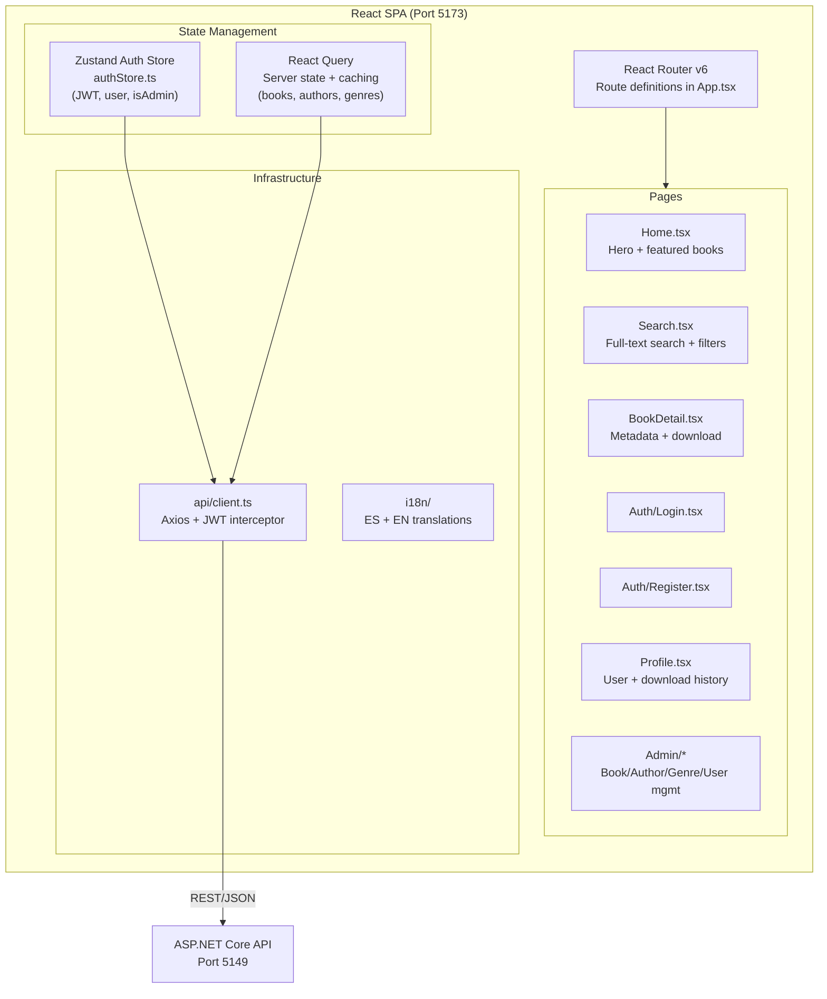

# Chapter 09 — React Frontend (Path A)

> *"React is not a framework — it's a library for thinking in components."*

---

## Chapter Objectives

By the end of this chapter you will:
- Have a running React 18 + TypeScript + Vite application connected to the API
- Understand the Zustand auth store and how localStorage persistence works
- Have all pages implemented: Home, Search, Book Detail, Login, Register, Profile, Admin
- Have bilingual support (Spanish/English) with i18next
- Have the Barnes & Noble-inspired Tailwind CSS theme applied

---

## 9.1 Architecture Overview



---

## 9.2 Project Configuration

### Tailwind CSS — Barnes & Noble Theme

**File:** `src/EBookLibrary.React/tailwind.config.js`

```js
/** @type {import('tailwindcss').Config} */
export default {
  content: ['./index.html', './src/**/*.{js,ts,jsx,tsx}'],
  theme: {
    extend: {
      colors: {
        primary: {
          50:  '#f0f4ff',
          100: '#e0e8ff',
          500: '#1a3c7c',   // Barnes & Noble dark navy
          600: '#152e63',
          700: '#0f2146',
          900: '#070e2b',
        },
        accent: {
          400: '#d4163e',
          500: '#b0133a',   // Burgundy accent
          600: '#8c0f2e',
        },
      },
      fontFamily: {
        serif: ['Georgia', 'Cambria', 'Times New Roman', 'serif'],
        sans:  ['Inter', 'system-ui', 'Helvetica Neue', 'sans-serif'],
      },
    },
  },
  plugins: [require('@tailwindcss/typography')],
};
```

**File:** `src/EBookLibrary.React/src/index.css`

```css
@tailwind base;
@tailwind components;
@tailwind utilities;

@layer base {
  body { @apply font-sans bg-gray-50 text-gray-900; }
  h1, h2, h3 { @apply font-serif; }
}

@layer components {
  .btn-primary {
    @apply bg-primary-500 hover:bg-primary-600 text-white font-semibold
           py-2 px-6 rounded-lg transition-colors duration-200;
  }
  .btn-accent {
    @apply bg-accent-500 hover:bg-accent-600 text-white font-semibold
           py-2 px-6 rounded-lg transition-colors duration-200;
  }
  .book-card {
    @apply bg-white rounded-xl shadow-sm hover:shadow-md border border-gray-100
           transition-all duration-200 hover:border-primary-500/20 cursor-pointer;
  }
  .input-field {
    @apply w-full rounded-lg border border-gray-300 px-4 py-2.5 text-sm
           focus:border-primary-500 focus:outline-none focus:ring-2
           focus:ring-primary-500/20 transition-colors;
  }
}
```

---

## 9.3 TypeScript Types

**File:** `src/EBookLibrary.React/src/types/api.ts`

```typescript
// Auth
export interface LoginRequest  { email: string; password: string; }
export interface RegisterRequest {
  email: string; password: string; confirmPassword: string;
  firstName?: string; lastName?: string;
}
export interface AuthResponse {
  userId: string; email: string;
  firstName?: string; lastName?: string;
  role: 'Regular' | 'Admin';
  token: string; expiresAt: string;
}

// Books
export interface BookSummary {
  id: string; title: string; pages: number;
  publicationYear?: number; coverImageUrl?: string;
  status: 'Available' | 'Unavailable' | 'Removed';
  hasFile: boolean; primaryAuthor: string; primaryGenre: string;
}
export interface BookDetail extends BookSummary {
  isbn?: string; description?: string; language: string;
  authors: string[]; genres: string[];
}
export interface BookSearchFilter {
  title?: string; authorName?: string; genreName?: string;
  publicationYear?: number; pageNumber?: number; pageSize?: number;
}

// Catalog
export interface Author { id: string; name: string; biography?: string; bookCount?: number; }
export interface Genre  { id: string; name: string; description?: string; bookCount?: number; }

// API Envelope
export interface ApiResponse<T> {
  success: boolean; data: T; message?: string; errors?: string[];
}
export interface PagedResult<T> {
  items: T[]; totalCount: number; pageNumber: number; pageSize: number;
  totalPages: number; hasPreviousPage: boolean; hasNextPage: boolean;
}
```

---

## 9.4 Axios API Client

**File:** `src/EBookLibrary.React/src/api/client.ts`

```typescript
import axios from 'axios';

const BASE_URL = import.meta.env.VITE_API_URL ?? 'http://localhost:5149/api';

const apiClient = axios.create({
  baseURL: BASE_URL,
  headers: { 'Content-Type': 'application/json' },
});

// Request interceptor — attach JWT to every request
apiClient.interceptors.request.use((config) => {
  const token = localStorage.getItem('auth_token');
  if (token) {
    config.headers.Authorization = `Bearer ${token}`;
  }
  return config;
});

// Response interceptor — handle 401 globally
apiClient.interceptors.response.use(
  (response) => response,
  (error) => {
    if (error.response?.status === 401) {
      // Token expired or invalid — clear auth state
      localStorage.removeItem('auth_token');
      localStorage.removeItem('auth-storage');
      window.location.href = '/login';
    }
    return Promise.reject(error);
  }
);

export default apiClient;
```

### API Service Functions

**File:** `src/EBookLibrary.React/src/api/books.ts`

```typescript
import apiClient from './client';
import type { ApiResponse, BookDetail, BookSearchFilter, BookSummary, PagedResult } from '../types/api';

export const booksApi = {
  search: (filter: BookSearchFilter) =>
    apiClient.get<ApiResponse<PagedResult<BookSummary>>>('/books/search', { params: filter }),

  getById: (id: string) =>
    apiClient.get<ApiResponse<BookDetail>>(`/books/${id}`),

  download: (id: string) =>
    apiClient.post(`/books/${id}/download`, null, { responseType: 'blob' }),

  create: (data: unknown) =>
    apiClient.post<ApiResponse<BookDetail>>('/books', data),

  update: (id: string, data: unknown) =>
    apiClient.put<ApiResponse<BookDetail>>(`/books/${id}`, data),

  delete: (id: string) =>
    apiClient.delete(`/books/${id}`),
};
```

---

## 9.5 Zustand Auth Store — The Core State

The auth store is the most important state file in the React app. It manages JWT storage, user info, and persistence.

**File:** `src/EBookLibrary.React/src/stores/authStore.ts`

```typescript
import { create } from 'zustand';
import { persist } from 'zustand/middleware';
import type { AuthResponse } from '../types/api';

interface AuthUser {
  token: string;
  userId: string;
  email: string;
  role: 'Regular' | 'Admin';
  expiresAt: string;
  firstName?: string;
  lastName?: string;
}

interface AuthState {
  user: AuthUser | null;
  isAuthenticated: boolean;
  isAdmin: boolean;
  setAuth: (response: AuthResponse) => void;
  clearAuth: () => void;
}

export const useAuthStore = create<AuthState>()(
  persist(
    (set) => ({
      user: null,
      isAuthenticated: false,
      isAdmin: false,

      setAuth: (response: AuthResponse) => {
        // Store raw token separately for the Axios interceptor
        localStorage.setItem('auth_token', response.token);

        set({
          user: {
            token: response.token,
            userId: response.userId,
            email: response.email,
            role: response.role,
            expiresAt: response.expiresAt,
            firstName: response.firstName,
            lastName: response.lastName,
          },
          isAuthenticated: true,
          isAdmin: response.role === 'Admin',
        });
      },

      clearAuth: () => {
        localStorage.removeItem('auth_token');
        set({ user: null, isAuthenticated: false, isAdmin: false });
      },
    }),
    {
      name: 'auth-storage',  // localStorage key for the full state
      // Only persist these fields (don't persist the full state)
      partialize: (state) => ({
        user: state.user,
        isAuthenticated: state.isAuthenticated,
        isAdmin: state.isAdmin,
      }),
    }
  )
);
```

### Why Two Storage Keys?

Zustand `persist` middleware stores the entire auth state as JSON in `localStorage['auth-storage']`.

The Axios interceptor reads `localStorage['auth_token']` (raw string, not JSON) for the `Authorization` header.

Both are set by `setAuth()` — they must stay in sync. If you add a logout flow, clear both.

---

## 9.6 React Router — Route Structure

**File:** `src/EBookLibrary.React/src/App.tsx`

```tsx
import { BrowserRouter, Routes, Route, Navigate } from 'react-router-dom';
import { QueryClient, QueryClientProvider } from '@tanstack/react-query';
import { MainLayout } from './layouts/MainLayout';
import HomePage from './pages/Home';
import SearchPage from './pages/Search';
import BookDetailPage from './pages/BookDetail';
import LoginPage from './pages/Auth/Login';
import RegisterPage from './pages/Auth/Register';
import ProfilePage from './pages/Profile';
import AdminDashboard from './pages/Admin/Dashboard';
import BookManagement from './pages/Admin/BookManagement';
import AuthorManagement from './pages/Admin/AuthorManagement';
import GenreManagement from './pages/Admin/GenreManagement';
import UserManagement from './pages/Admin/UserManagement';
import { ProtectedRoute } from './components/ProtectedRoute';
import './i18n';

const queryClient = new QueryClient({
  defaultOptions: {
    queries: {
      staleTime: 5 * 60 * 1000,  // 5 minutes cache
      retry: 1,
    },
  },
});

export default function App() {
  return (
    <QueryClientProvider client={queryClient}>
      <BrowserRouter>
        <Routes>
          <Route path="/" element={<MainLayout />}>
            {/* Public routes */}
            <Route index element={<HomePage />} />
            <Route path="search" element={<SearchPage />} />
            <Route path="books/:id" element={<BookDetailPage />} />
            <Route path="login" element={<LoginPage />} />
            <Route path="register" element={<RegisterPage />} />

            {/* Authenticated routes */}
            <Route element={<ProtectedRoute />}>
              <Route path="profile" element={<ProfilePage />} />
            </Route>

            {/* Admin routes */}
            <Route element={<ProtectedRoute requireAdmin />}>
              <Route path="admin" element={<AdminDashboard />} />
              <Route path="admin/books" element={<BookManagement />} />
              <Route path="admin/authors" element={<AuthorManagement />} />
              <Route path="admin/genres" element={<GenreManagement />} />
              <Route path="admin/users" element={<UserManagement />} />
            </Route>

            <Route path="*" element={<Navigate to="/" replace />} />
          </Route>
        </Routes>
      </BrowserRouter>
    </QueryClientProvider>
  );
}
```

### Protected Route Component

**File:** `src/EBookLibrary.React/src/components/ProtectedRoute.tsx`

```tsx
import { Navigate, Outlet } from 'react-router-dom';
import { useAuthStore } from '../stores/authStore';

interface ProtectedRouteProps {
  requireAdmin?: boolean;
}

export function ProtectedRoute({ requireAdmin = false }: ProtectedRouteProps) {
  const { isAuthenticated, isAdmin } = useAuthStore();

  if (!isAuthenticated) return <Navigate to="/login" replace />;
  if (requireAdmin && !isAdmin) return <Navigate to="/" replace />;

  return <Outlet />;
}
```

---

## 9.7 i18next Internationalization

**File:** `src/EBookLibrary.React/src/i18n/index.ts`

```typescript
import i18n from 'i18next';
import { initReactI18next } from 'react-i18next';
import LanguageDetector from 'i18next-browser-languagedetector';
import en from './locales/en.json';
import es from './locales/es.json';

i18n
  .use(LanguageDetector)      // Auto-detect browser language
  .use(initReactI18next)
  .init({
    resources: {
      en: { translation: en },
      es: { translation: es },
    },
    fallbackLng: 'es',         // Default to Spanish (library content is Spanish)
    interpolation: { escapeValue: false },
    detection: {
      order: ['localStorage', 'navigator'],
      caches: ['localStorage'],
    },
  });

export default i18n;
```

**File:** `src/EBookLibrary.React/src/i18n/locales/es.json` (excerpt)

```json
{
  "nav": {
    "home": "Inicio",
    "search": "Buscar",
    "profile": "Perfil",
    "admin": "Administración",
    "login": "Iniciar sesión",
    "register": "Registrarse",
    "logout": "Cerrar sesión"
  },
  "search": {
    "placeholder": "Buscar por título, autor o género...",
    "results": "{{count}} resultados encontrados",
    "noResults": "No se encontraron libros",
    "filters": { "title": "Título", "author": "Autor", "genre": "Género" }
  },
  "book": {
    "download": "Descargar ePub",
    "pages": "{{count}} páginas",
    "author": "Autor",
    "genre": "Género",
    "year": "Año de publicación",
    "available": "Disponible",
    "unavailable": "No disponible"
  }
}
```

**Usage in components:**
```tsx
import { useTranslation } from 'react-i18next';

function SearchPage() {
  const { t } = useTranslation();
  return <input placeholder={t('search.placeholder')} />;
}
```

---

## 9.8 Key Page Implementations

### Search Page

**File:** `src/EBookLibrary.React/src/pages/Search.tsx` (key sections)

```tsx
import { useSearchParams } from 'react-router-dom';
import { useQuery } from '@tanstack/react-query';
import { useTranslation } from 'react-i18next';
import { booksApi } from '../api/books';
import { BookCard } from '../components/BookCard';

export default function SearchPage() {
  const { t } = useTranslation();
  const [searchParams, setSearchParams] = useSearchParams();

  const filter = {
    title:      searchParams.get('title')      ?? undefined,
    authorName: searchParams.get('author')     ?? undefined,
    genreName:  searchParams.get('genre')      ?? undefined,
    pageNumber: parseInt(searchParams.get('page') ?? '1'),
    pageSize:   20,
  };

  const { data, isLoading } = useQuery({
    queryKey: ['books', 'search', filter],
    queryFn:  () => booksApi.search(filter).then(r => r.data.data),
    staleTime: 2 * 60 * 1000,
  });

  return (
    <div className="container mx-auto px-4 py-8">
      {/* Search form */}
      <div className="grid grid-cols-1 md:grid-cols-3 gap-4 mb-8">
        <input
          className="input-field"
          placeholder={t('search.filters.title')}
          defaultValue={filter.title}
          onChange={(e) => setSearchParams(p => {
            p.set('title', e.target.value);
            p.set('page', '1');
            return p;
          })}
        />
        {/* Author and genre inputs — same pattern */}
      </div>

      {/* Results */}
      {isLoading ? (
        <div className="grid grid-cols-2 md:grid-cols-4 gap-4">
          {Array.from({ length: 8 }).map((_, i) => (
            <div key={i} className="book-card h-64 animate-pulse bg-gray-100" />
          ))}
        </div>
      ) : (
        <>
          <p className="text-gray-600 mb-4">
            {t('search.results', { count: data?.totalCount ?? 0 })}
          </p>
          <div className="grid grid-cols-2 md:grid-cols-4 gap-4">
            {data?.items.map((book) => (
              <BookCard key={book.id} book={book} />
            ))}
          </div>
          {/* Pagination */}
        </>
      )}
    </div>
  );
}
```

### Book Detail Page (Download Integration)

```tsx
import { useParams } from 'react-router-dom';
import { useQuery } from '@tanstack/react-query';
import { useAuthStore } from '../stores/authStore';
import { booksApi } from '../api/books';

export default function BookDetailPage() {
  const { id } = useParams<{ id: string }>();
  const { isAuthenticated } = useAuthStore();
  const { t } = useTranslation();

  const { data: book } = useQuery({
    queryKey: ['book', id],
    queryFn:  () => booksApi.getById(id!).then(r => r.data.data),
  });

  const handleDownload = async () => {
    const response = await booksApi.download(book!.id);
    // Create a blob URL and trigger download
    const url = window.URL.createObjectURL(new Blob([response.data]));
    const link = document.createElement('a');
    link.href = url;
    link.download = `${book!.title}.epub`;
    link.click();
    window.URL.revokeObjectURL(url);
  };

  return (
    <div className="container mx-auto px-4 py-8">
      <div className="max-w-4xl mx-auto flex gap-8">
        {/* Cover image */}
        <div className="w-48 flex-shrink-0">
          <div className="w-full aspect-[2/3] bg-primary-500 rounded-lg flex items-center justify-center">
            <span className="text-white text-xs text-center p-2">{book?.title}</span>
          </div>
        </div>

        {/* Details */}
        <div className="flex-1">
          <h1 className="text-3xl font-serif font-bold text-primary-700 mb-2">
            {book?.title}
          </h1>
          <p className="text-accent-500 font-medium mb-4">{book?.authors?.join(', ')}</p>
          <p className="text-gray-600 mb-6">{book?.description}</p>

          {isAuthenticated && book?.hasFile ? (
            <button onClick={handleDownload} className="btn-accent">
              {t('book.download')}
            </button>
          ) : !isAuthenticated ? (
            <Link to="/login" className="btn-primary">
              {t('auth.loginToDownload')}
            </Link>
          ) : null}
        </div>
      </div>
    </div>
  );
}
```

---

## 9.9 Admin Pages — CRUD Pattern

All admin CRUD pages follow the same pattern: a table of records + a modal form for create/edit.

**Pattern summary for `AuthorManagement.tsx`:**

```tsx
export default function AuthorManagement() {
  const [isModalOpen, setIsModalOpen] = useState(false);
  const [editingAuthor, setEditingAuthor] = useState<Author | null>(null);

  // Load paginated list with React Query
  const { data: authors } = useQuery({
    queryKey: ['admin', 'authors'],
    queryFn: () => adminApi.getAuthors().then(r => r.data.data),
  });

  // Create/Update mutation
  const mutation = useMutation({
    mutationFn: editingAuthor
      ? (data: AuthorFormData) => adminApi.updateAuthor(editingAuthor.id, data)
      : (data: AuthorFormData) => adminApi.createAuthor(data),
    onSuccess: () => {
      queryClient.invalidateQueries({ queryKey: ['admin', 'authors'] });
      setIsModalOpen(false);
      setEditingAuthor(null);
    },
  });

  return (
    <div>
      <button onClick={() => setIsModalOpen(true)} className="btn-primary">
        Add Author
      </button>

      {/* Authors table */}
      <table>
        {authors?.items.map(author => (
          <tr key={author.id}>
            <td>{author.name}</td>
            <td>
              <button onClick={() => { setEditingAuthor(author); setIsModalOpen(true); }}>
                Edit
              </button>
            </td>
          </tr>
        ))}
      </table>

      {/* Modal — Tailwind fixed overlay */}
      {isModalOpen && (
        <div className="fixed inset-0 bg-black/50 flex items-center justify-center z-50">
          <div className="bg-white rounded-xl p-6 w-full max-w-md">
            <AuthorForm
              initialData={editingAuthor}
              onSubmit={mutation.mutate}
              onCancel={() => setIsModalOpen(false)}
            />
          </div>
        </div>
      )}
    </div>
  );
}
```

### Users Admin Page (`UsersPage.tsx`)

The Users admin page extends the basic CRUD pattern with three user-management actions and a self-protection guard:

```tsx
// Self-protection: read current user ID from auth store
const currentUserId = useAuthStore(s => s.user?.userId);

// State: discriminated unions prevent stale modal data
type EditState   = { open: false } | { open: true; user: User };
type DeleteState = { open: false } | { open: true; user: User };

// Three mutations
const statusMutation = useMutation({ mutationFn: (id) => usersApi.updateStatus(id) });
const editMutation   = useMutation({ mutationFn: ({ id, data }) => usersApi.updateUser(id, data) });
const deleteMutation = useMutation({ mutationFn: (id) => usersApi.deleteUser(id) });
```

Action buttons per row (self-protection via `disabled={user.id === currentUserId}`):

| Button | Icon | API call | Self blocked? |
|---|---|---|---|
| Role toggle | text | `PATCH .../role` | Yes |
| Status toggle | `<Power />` (lucide) | `PATCH .../status` | Yes |
| Edit | `<Pencil />` (lucide) | `PUT .../{id}` | No |
| Delete | `<Trash2 />` (lucide) | `DELETE .../{id}` | Yes |

Delete uses a single confirmation dialog (`max-w-md`, `break-all` on the email text to prevent overflow). Edit uses a full form modal with firstName, lastName, email, and an optional newPassword field.

---

## 9.10 Running the React App

```bash
cd src/EBookLibrary.React

# Development server
npm run dev
# Opens http://localhost:5173

# Production build
npm run build
# Output in dist/

# Preview production build
npm run preview
```

### Environment Variables

**File:** `src/EBookLibrary.React/.env.development`
```
VITE_API_URL=http://localhost:5149/api
```

**File:** `src/EBookLibrary.React/.env.production`
```
VITE_API_URL=https://your-production-api.com/api
```

---

## 9.11 Checkpoint ✅

The React frontend is complete when:

- [ ] `npm run dev` starts without errors at `http://localhost:5173`
- [ ] Home page renders with the Barnes & Noble dark navy theme
- [ ] Search page shows books from the API (search for "quijote")
- [ ] Book detail page shows book metadata
- [ ] Login and Register forms work and store the token
- [ ] After login, the header shows the user's name and a logout option
- [ ] Profile page shows user info and download history
- [ ] Admin pages are hidden for Regular users
- [ ] Admin can create/edit/delete books, authors, genres
- [ ] Admin Users page: role toggle, status toggle (Power icon), edit modal, delete dialog all work
- [ ] Status toggle, role toggle, and delete buttons are disabled for the currently logged-in admin row
- [ ] Language switcher toggles between Spanish and English
- [ ] Download button works for authenticated users with available books

---

## 9.12 🤖 AI-Assisted Development — React Frontend

**What Copilot generated well:**
- Component skeletons with correct TypeScript types
- Zustand store structure
- React Query usage patterns (queryKey, queryFn, staleTime)
- i18next setup and translation usage

**What required correction:**
- Tailwind version: initially generated `@apply` directives assuming v4 syntax. Fixed by specifying `tailwindcss@3` in package.json.
- Zustand `persist` middleware: the `partialize` option was missing, meaning the entire store state (including functions) would be serialized — corrected to serialize only data.
- The 401 response interceptor in `client.ts` initially used `history.push('/login')` (React Router v5 API) instead of `window.location.href`.

> **Tip:** For Zustand stores, always explicitly define the `partialize` option to control what gets persisted. Serializing functions causes silent JSON errors.

---

## Further Reading

- [docs/08-REACT-FRONTEND.md](../docs/08-REACT-FRONTEND.md) — Original React frontend prompt document
- Zustand documentation: https://zustand-demo.pmnd.rs
- React Query (TanStack Query): https://tanstack.com/query/latest
- i18next: https://www.i18next.com

---

**← Previous:** [08 — Database & Migrations](08-DATABASE-MIGRATIONS.md)  
**Next →** [10 — Blazor Frontend](10-BLAZOR-FRONTEND.md) *(Path B)*  
**Or skip to →** [11 — Unit Tests](11-UNIT-TESTS.md)
