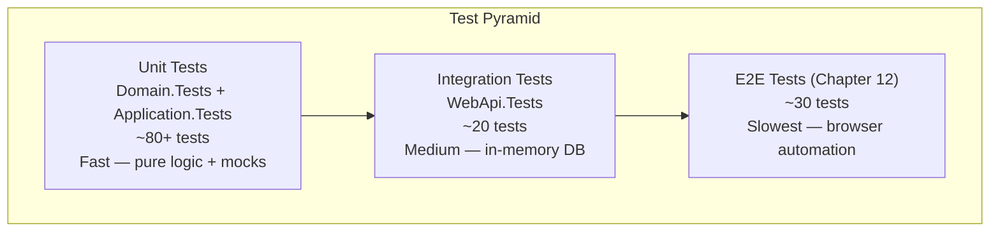

# Chapter 11 — Unit Tests

> *"A test suite that covers your handlers is a safety net that lets you refactor fearlessly."*

---

## Chapter Objectives

By the end of this chapter you will:
- Have unit tests for all domain entities (pure logic, no mocks needed)
- Have handler tests for the Application layer using Moq and FluentAssertions
- Have integration tests for the API layer using WebApplicationFactory
- Understand the >80% coverage target strategy for Application handlers
- Know the testing patterns that make tests readable and maintainable

---

## 11.1 Testing Strategy



| Test Type | Project | Speed | What's Mocked |
|---|---|---|---|
| Domain Unit | `Domain.Tests` | < 1ms | Nothing — pure C# |
| Application Unit | `Application.Tests` | 1-5ms | IUnitOfWork, IJwtTokenService, etc. |
| API Integration | `WebApi.Tests` | 50-200ms | Database (in-memory SQLite) |
| E2E | `E2E.Tests` | 2-10s | Nothing — real browser + server |

---

## 11.2 Test Infrastructure

### MockFactory

**File:** `tests/EBookLibrary.Application.Tests/TestHelpers/MockFactory.cs`

```csharp
using Moq;

namespace EBookLibrary.Application.Tests.TestHelpers;

public static class TestMockFactory
{
    public static Mock<IUnitOfWork> CreateUnitOfWork(
        Mock<IBookRepository>? books = null,
        Mock<IAuthorRepository>? authors = null,
        Mock<IGenreRepository>? genres = null,
        Mock<IUserRepository>? users = null,
        Mock<IBookDownloadRepository>? downloads = null)
    {
        books     ??= new Mock<IBookRepository>();
        authors   ??= new Mock<IAuthorRepository>();
        genres    ??= new Mock<IGenreRepository>();
        users     ??= new Mock<IUserRepository>();
        downloads ??= new Mock<IBookDownloadRepository>();

        var uow = new Mock<IUnitOfWork>();
        uow.Setup(u => u.Books).Returns(books.Object);
        uow.Setup(u => u.Authors).Returns(authors.Object);
        uow.Setup(u => u.Genres).Returns(genres.Object);
        uow.Setup(u => u.Users).Returns(users.Object);
        uow.Setup(u => u.BookDownloads).Returns(downloads.Object);
        uow.Setup(u => u.SaveChangesAsync(It.IsAny<CancellationToken>())).ReturnsAsync(1);

        return uow;
    }

    public static Mock<IJwtTokenService> CreateJwtService(string returnToken = "mock-jwt-token")
    {
        var mock = new Mock<IJwtTokenService>();
        mock.Setup(s => s.GenerateToken(It.IsAny<Guid>(), It.IsAny<string>(), It.IsAny<string>()))
            .Returns(returnToken);
        return mock;
    }

    public static Mock<IPasswordHashService> CreatePasswordHashService(
        string hashedPassword = "hashed-password", bool verifyResult = true)
    {
        var mock = new Mock<IPasswordHashService>();
        mock.Setup(s => s.HashPassword(It.IsAny<string>())).Returns(hashedPassword);
        mock.Setup(s => s.VerifyPassword(It.IsAny<string>(), It.IsAny<string>()))
            .Returns(verifyResult);
        return mock;
    }

    public static Mock<ICurrentUserService> CreateCurrentUserService(
        Guid? userId = null, string role = "Regular", bool isAuthenticated = true)
    {
        var id = userId ?? Guid.NewGuid();
        var mock = new Mock<ICurrentUserService>();
        mock.Setup(s => s.UserId).Returns(id);
        mock.Setup(s => s.Role).Returns(role);
        mock.Setup(s => s.IsAuthenticated).Returns(isAuthenticated);
        mock.Setup(s => s.IsAdmin).Returns(role == "Admin");
        return mock;
    }
}
```

### Entity Builders

**File:** `tests/EBookLibrary.Application.Tests/TestHelpers/EntityBuilders.cs`

```csharp
namespace EBookLibrary.Application.Tests.TestHelpers;

public static class EntityBuilders
{
    public static User BuildUser(string email = "test@example.com",
        string role = "Regular", bool isActive = true)
    {
        var user = User.Create(email, "hashed-password");
        if (role == "Admin") user.UpdateRole(UserRole.Admin);
        if (!isActive) user.Deactivate();
        return user;
    }

    public static Book BuildBook(string title = "Test Book",
        BookStatus status = BookStatus.Available)
    {
        var book = Book.Create(title);
        if (status == BookStatus.Available)
            book.SetFilePath("test-genre/test.epub");
        return book;
    }

    public static Author BuildAuthor(string name = "Test Author")
        => Author.Create(name);

    public static Genre BuildGenre(string name = "Test Genre")
        => Genre.Create(name);
}
```

---

## 11.3 Domain Tests

Domain tests verify entity business rules — no mocks needed.

**File:** `tests/EBookLibrary.Domain.Tests/Entities/BookTests.cs`

```csharp
using EBookLibrary.Domain.Entities;
using EBookLibrary.Domain.Enums;
using FluentAssertions;

namespace EBookLibrary.Domain.Tests.Entities;

public class BookTests
{
    [Fact]
    public void Create_WithValidTitle_SetsCorrectDefaults()
    {
        var book = Book.Create("Don Quixote");

        book.Title.Should().Be("Don Quixote");
        book.Status.Should().Be(BookStatus.Unavailable);
        book.IsDeleted.Should().BeFalse();
        book.Id.Should().NotBeEmpty();
        book.CreatedAt.Should().BeCloseTo(DateTime.UtcNow, precision: TimeSpan.FromSeconds(5));
    }

    [Theory]
    [InlineData("")]
    [InlineData("   ")]
    [InlineData(null)]
    public void Create_WithEmptyOrWhitespaceTitle_ThrowsArgumentException(string? title)
    {
        var act = () => Book.Create(title!);
        act.Should().Throw<ArgumentException>();
    }

    [Fact]
    public void Create_WithTitleExceeding500Chars_ThrowsArgumentException()
    {
        var longTitle = new string('A', 501);
        var act = () => Book.Create(longTitle);
        act.Should().Throw<ArgumentException>().WithMessage("*500*");
    }

    [Fact]
    public void SetFilePath_UpdatesStatusToAvailable()
    {
        var book = Book.Create("Test Book");
        book.Status.Should().Be(BookStatus.Unavailable);

        book.SetFilePath("fiction/test.epub");

        book.Status.Should().Be(BookStatus.Available);
        book.FilePath.Should().Be("fiction/test.epub");
        book.UpdatedAt.Should().NotBeNull();
    }

    [Fact]
    public void IsAvailableForDownload_WhenAvailableAndNotDeleted_ReturnsTrue()
    {
        var book = Book.Create("Test Book");
        book.SetFilePath("fiction/test.epub");

        book.IsAvailableForDownload().Should().BeTrue();
    }

    [Fact]
    public void IsAvailableForDownload_WhenSoftDeleted_ReturnsFalse()
    {
        var book = Book.Create("Test Book");
        book.SetFilePath("fiction/test.epub");
        book.SoftDelete();

        book.IsAvailableForDownload().Should().BeFalse();
    }

    [Fact]
    public void SoftDelete_SetsIsDeletedTrue_AndUpdatesTimestamp()
    {
        var book = Book.Create("Test Book");

        book.SoftDelete();

        book.IsDeleted.Should().BeTrue();
        book.UpdatedAt.Should().NotBeNull();
    }
}
```

**File:** `tests/EBookLibrary.Domain.Tests/Entities/UserTests.cs`

```csharp
public class UserTests
{
    [Fact]
    public void Create_NormalizesEmailToLowerCase()
    {
        var user = User.Create("USER@EXAMPLE.COM", "hash");
        user.Email.Should().Be("user@example.com");
    }

    [Fact]
    public void Create_DefaultsToRegularRole_AndIsActive()
    {
        var user = User.Create("user@example.com", "hash");
        user.Role.Should().Be(UserRole.Regular);
        user.IsActive.Should().BeTrue();
    }

    [Fact]
    public void UpdateRole_ChangesRoleToAdmin()
    {
        var user = User.Create("user@example.com", "hash");
        user.UpdateRole(UserRole.Admin);
        user.Role.Should().Be(UserRole.Admin);
    }

    [Fact]
    public void Deactivate_SetsIsActiveFalse()
    {
        var user = User.Create("user@example.com", "hash");
        user.Deactivate();
        user.IsActive.Should().BeFalse();
    }
}
```

---

## 11.4 Application Handler Tests

### LoginUserCommandHandler Tests (Full Example)

**File:** `tests/EBookLibrary.Application.Tests/Auth/LoginUserCommandHandlerTests.cs`

```csharp
using EBookLibrary.Application.Auth.Commands.LoginUser;
using EBookLibrary.Application.Tests.TestHelpers;
using FluentAssertions;
using Moq;

namespace EBookLibrary.Application.Tests.Auth;

public class LoginUserCommandHandlerTests
{
    private readonly Mock<IUserRepository> _userRepoMock;
    private readonly Mock<IUnitOfWork> _uowMock;
    private readonly Mock<IJwtTokenService> _jwtMock;
    private readonly Mock<IPasswordHashService> _hashMock;
    private readonly LoginUserCommandHandler _handler;

    public LoginUserCommandHandlerTests()
    {
        _userRepoMock = new Mock<IUserRepository>();
        _jwtMock      = TestMockFactory.CreateJwtService("test-jwt-token");
        _hashMock     = TestMockFactory.CreatePasswordHashService(verifyResult: true);
        _uowMock      = TestMockFactory.CreateUnitOfWork(users: _userRepoMock);
        _handler      = new LoginUserCommandHandler(_uowMock.Object, _jwtMock.Object, _hashMock.Object);
    }

    [Fact]
    public async Task Handle_WithValidCredentials_ReturnsAuthResponse()
    {
        // Arrange
        var user = EntityBuilders.BuildUser("user@example.com");
        _userRepoMock.Setup(r => r.GetByEmailAsync("user@example.com", It.IsAny<CancellationToken>()))
            .ReturnsAsync(user);

        // Act
        var result = await _handler.Handle(
            new LoginUserCommand("user@example.com", "correct-password"),
            CancellationToken.None);

        // Assert
        result.Should().NotBeNull();
        result.Token.Should().Be("test-jwt-token");
        result.Email.Should().Be("user@example.com");
        result.Role.Should().Be("Regular");
    }

    [Fact]
    public async Task Handle_UserNotFound_ThrowsUnauthorizedAccessException()
    {
        // Arrange — repository returns null
        _userRepoMock.Setup(r => r.GetByEmailAsync(It.IsAny<string>(), It.IsAny<CancellationToken>()))
            .ReturnsAsync((User?)null);

        // Act
        var act = () => _handler.Handle(
            new LoginUserCommand("notfound@example.com", "password"),
            CancellationToken.None);

        // Assert
        await act.Should().ThrowAsync<UnauthorizedAccessException>()
            .WithMessage("*Invalid email or password*");
    }

    [Fact]
    public async Task Handle_WrongPassword_ThrowsUnauthorizedAccessException()
    {
        // Arrange — password verification returns false
        var hashMock = TestMockFactory.CreatePasswordHashService(verifyResult: false);
        var handler = new LoginUserCommandHandler(_uowMock.Object, _jwtMock.Object, hashMock.Object);

        var user = EntityBuilders.BuildUser("user@example.com");
        _userRepoMock.Setup(r => r.GetByEmailAsync("user@example.com", It.IsAny<CancellationToken>()))
            .ReturnsAsync(user);

        // Act
        var act = () => handler.Handle(
            new LoginUserCommand("user@example.com", "wrong-password"),
            CancellationToken.None);

        // Assert
        await act.Should().ThrowAsync<UnauthorizedAccessException>();
    }

    [Fact]
    public async Task Handle_InactiveUser_ThrowsUnauthorizedAccessException()
    {
        // Arrange
        var inactiveUser = EntityBuilders.BuildUser("inactive@example.com", isActive: false);
        _userRepoMock.Setup(r => r.GetByEmailAsync("inactive@example.com", It.IsAny<CancellationToken>()))
            .ReturnsAsync(inactiveUser);

        // Act
        var act = () => _handler.Handle(
            new LoginUserCommand("inactive@example.com", "password"),
            CancellationToken.None);

        // Assert — same error message as "user not found" (no enumeration)
        await act.Should().ThrowAsync<UnauthorizedAccessException>()
            .WithMessage("*Invalid email or password*");
    }
}
```

### SearchBooksQueryHandler Tests

```csharp
public class SearchBooksQueryHandlerTests
{
    [Fact]
    public async Task Handle_WithTitle_CallsSearchWithCorrectFilter()
    {
        // Arrange
        var bookRepoMock = new Mock<IBookRepository>();
        var mapperMock   = new Mock<IMapper>();
        var uowMock      = TestMockFactory.CreateUnitOfWork(books: bookRepoMock);

        var expectedBooks = new List<Book> { EntityBuilders.BuildBook("Test Book") };
        bookRepoMock.Setup(r => r.SearchAsync(
                "Test", null, null, null, 1, 20, It.IsAny<CancellationToken>()))
            .ReturnsAsync((expectedBooks, 1));

        mapperMock.Setup(m => m.Map<IEnumerable<BookSummaryDto>>(It.IsAny<IEnumerable<Book>>()))
            .Returns(new[] { new BookSummaryDto(Guid.NewGuid(), "Test Book",
                0, null, null, "Available", true, "Author", "Genre") });

        var handler = new SearchBooksQueryHandler(uowMock.Object, mapperMock.Object);
        var filter  = new BookSearchFilterDto(Title: "Test", PageNumber: 1, PageSize: 20);

        // Act
        var result = await handler.Handle(new SearchBooksQuery(filter), CancellationToken.None);

        // Assert
        result.Should().NotBeNull();
        result.TotalCount.Should().Be(1);
        result.Items.Should().HaveCount(1);

        bookRepoMock.Verify(r => r.SearchAsync(
            "Test", null, null, null, 1, 20, It.IsAny<CancellationToken>()), Times.Once);
    }
}
```

---

## 11.5 API Integration Tests

Integration tests use `WebApplicationFactory<Program>` to spin up the API with an in-memory SQLite database:

**File:** `tests/EBookLibrary.WebApi.Tests/Integration/WebApiFactory.cs`

```csharp
using Microsoft.AspNetCore.Hosting;
using Microsoft.AspNetCore.Mvc.Testing;
using Microsoft.EntityFrameworkCore;
using Microsoft.Extensions.DependencyInjection;

namespace EBookLibrary.WebApi.Tests.Integration;

public class WebApiFactory : WebApplicationFactory<Program>
{
    protected override void ConfigureWebHost(IWebHostBuilder builder)
    {
        builder.ConfigureServices(services =>
        {
            // Remove the real SQL Server DbContext registration
            var descriptor = services.SingleOrDefault(
                d => d.ServiceType == typeof(DbContextOptions<AppDbContext>));
            if (descriptor != null) services.Remove(descriptor);

            // Add in-memory SQLite for tests
            services.AddDbContext<AppDbContext>(options =>
                options.UseSqlite("DataSource=:memory:"));
        });

        builder.UseEnvironment("Testing");
    }
}
```

**File:** `tests/EBookLibrary.WebApi.Tests/Controllers/AuthControllerTests.cs`

```csharp
using System.Net;
using System.Net.Http.Json;
using FluentAssertions;

namespace EBookLibrary.WebApi.Tests.Controllers;

public class AuthControllerTests : IClassFixture<WebApiFactory>
{
    private readonly HttpClient _client;

    public AuthControllerTests(WebApiFactory factory)
        => _client = factory.CreateClient();

    [Fact]
    public async Task Register_WithValidData_Returns201WithToken()
    {
        // Arrange
        var command = new { email = "newuser@test.com", password = "TestPass1!",
            confirmPassword = "TestPass1!" };

        // Act
        var response = await _client.PostAsJsonAsync("/api/auth/register", command);

        // Assert
        response.StatusCode.Should().Be(HttpStatusCode.Created);

        var body = await response.Content.ReadFromJsonAsync<ApiResponseDto<AuthResponseDto>>();
        body!.Success.Should().BeTrue();
        body.Data!.Token.Should().NotBeEmpty();
        body.Data.Role.Should().Be("Regular");
    }

    [Fact]
    public async Task Register_WithDuplicateEmail_Returns400()
    {
        // Register once
        var command = new { email = "duplicate@test.com", password = "TestPass1!",
            confirmPassword = "TestPass1!" };
        await _client.PostAsJsonAsync("/api/auth/register", command);

        // Register again with same email
        var response = await _client.PostAsJsonAsync("/api/auth/register", command);

        response.StatusCode.Should().Be(HttpStatusCode.BadRequest);
    }

    [Fact]
    public async Task Login_WithCorrectCredentials_ReturnsToken()
    {
        // Register first
        var email = $"logintest_{Guid.NewGuid()}@test.com";
        await _client.PostAsJsonAsync("/api/auth/register",
            new { email, password = "TestPass1!", confirmPassword = "TestPass1!" });

        // Login
        var response = await _client.PostAsJsonAsync("/api/auth/login",
            new { email, password = "TestPass1!" });

        response.StatusCode.Should().Be(HttpStatusCode.OK);
        var body = await response.Content.ReadFromJsonAsync<ApiResponseDto<AuthResponseDto>>();
        body!.Data!.Token.Should().NotBeEmpty();
    }

    [Fact]
    public async Task SearchBooks_WithoutToken_Returns200()
    {
        var response = await _client.GetAsync("/api/books/search?title=test");
        // Anonymous access is allowed for search
        response.StatusCode.Should().Be(HttpStatusCode.OK);
    }

    [Fact]
    public async Task DownloadBook_WithoutToken_Returns401()
    {
        var response = await _client.PostAsync(
            $"/api/books/{Guid.NewGuid()}/download", null);
        response.StatusCode.Should().Be(HttpStatusCode.Unauthorized);
    }
}
```

---

## 11.6 Running the Tests

```bash
# Run all unit tests
dotnet test tests/EBookLibrary.Domain.Tests
dotnet test tests/EBookLibrary.Application.Tests
dotnet test tests/EBookLibrary.WebApi.Tests

# Run with coverage report
dotnet test tests/EBookLibrary.Application.Tests \
  --collect:"XPlat Code Coverage" \
  --results-directory ./coverage

# Run with verbose output
dotnet test EBookLibrary.sln --verbosity normal

# Filter to a specific test class
dotnet test --filter "FullyQualifiedName~LoginUserCommandHandlerTests"
```

### Coverage Goal

The >80% coverage target applies to the **Application layer handlers**. Strategy:
- Test the happy path for every handler
- Test at least 2 failure cases per handler (not found, unauthorized, invalid input)
- Test edge cases for domain entities (null inputs, max length, invalid year)
- Skip testing AutoMapper profiles separately — they're covered by handler tests

---

## 11.7 Checkpoint ✅

Tests are complete when:

- [ ] `dotnet test tests/EBookLibrary.Domain.Tests` — all pass
- [ ] `dotnet test tests/EBookLibrary.Application.Tests` — all pass
- [ ] `dotnet test tests/EBookLibrary.WebApi.Tests` — all pass
- [ ] Each domain entity has tests for at least: happy path creation, invalid inputs, soft delete
- [ ] `LoginUserCommandHandler` has tests for: success, user not found, wrong password, inactive user
- [ ] `ToggleUserStatusCommandHandler` has tests for: activate, deactivate, not found
- [ ] `UpdateUserCommandHandler` has tests for: valid update, same email skip, duplicate email, password change, not found
- [ ] `DeleteUserCommandHandler` has tests for: valid delete, not found
- [ ] Validators tested for: `ToggleUserStatus`, `UpdateUser`, `DeleteUser` (including self-target rejection)
- [ ] `UsersControllerTests` covers 12 integration scenarios: 401 unauthorized, 204 success, 400 self-target, 404 not found for all three new endpoints
- [ ] Integration tests cover: register, login, anonymous search, unauthorized download

---

## 11.8 🤖 AI-Assisted Development — Unit Tests

**What Copilot generated well:**
- `TestMockFactory` structure with all mock setup patterns
- Domain entity tests — these are straightforward to generate
- xUnit test method structure with `[Fact]` and `[Theory]`

**What required correction:**
- Some mock setups used `It.IsAny<string>()` where specific values were needed for meaningful assertions
- Copilot occasionally generated `Assert.Equal` (xUnit style) mixed with `Should()` (FluentAssertions). Standardized on FluentAssertions for readability.
- Integration test setup — `WebApplicationFactory` with SQLite required manual configuration, AI generated the pattern incorrectly (missing the `UseSqlite` vs. `UseInMemoryDatabase` distinction).

---

## Further Reading

- [docs/10-UNIT-TESTS.md](../docs/10-UNIT-TESTS.md) — Original unit tests prompt document
- FluentAssertions docs: https://fluentassertions.com
- Moq quickstart: https://github.com/moq/moq4/wiki/Quickstart
- WebApplicationFactory: https://docs.microsoft.com/aspnet/core/test/integration-tests

---

**← Previous:** [10 — Blazor Frontend](10-BLAZOR-FRONTEND.md)  
**Next →** [12 — End-to-End Tests](12-E2E-TESTS.md)
