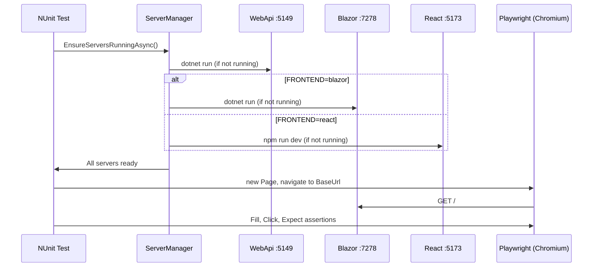

# Chapter 12 — End-to-End Tests

> *"E2E tests verify the whole application works together — browser, API, and database."*

---

## Chapter Objectives

By the end of this chapter you will:
- Understand the E2E test architecture using Playwright + NUnit
- Have tests for anonymous, regular user, and admin flows on both frontends
- Understand how the `ServerManager` orchestrates multiple processes
- Know how to inject authentication state for React (Zustand localStorage) and Blazor

---

## 12.1 Architecture Overview



---

## 12.2 Infrastructure

### ServerManager

**File:** `tests/EBookLibrary.E2E.Tests/Infrastructure/ServerManager.cs`

```csharp
namespace EBookLibrary.E2E.Tests.Infrastructure;

public static class ServerManager
{
    private static Process? _apiProcess;
    private static Process? _blazorProcess;
    private static Process? _reactProcess;

    private static readonly string SolutionRoot = FindSolutionRoot();

    public static async Task EnsureServersRunningAsync()
    {
        await EnsureApiRunningAsync();

        var frontend = Environment.GetEnvironmentVariable("FRONTEND") ?? "blazor";
        if (frontend.Equals("react", StringComparison.OrdinalIgnoreCase))
            await EnsureReactRunningAsync();
        else
            await EnsureBlazerRunningAsync();
    }

    private static async Task EnsureApiRunningAsync()
    {
        const int apiPort = 5149;
        if (await IsPortOpenAsync(apiPort))
        {
            Console.WriteLine("[ServerManager] ✓ API already running on :5149");
            return;
        }
        Console.WriteLine("[ServerManager] → Starting WebApi...");
        var apiDir = Path.Combine(SolutionRoot, "src", "EBookLibrary.WebApi");
        _apiProcess = Launch("dotnet", "run --no-build", apiDir);
        await WaitForPortAsync(apiPort, TimeSpan.FromSeconds(60), "WebApi :5149");
        Console.WriteLine("[ServerManager] ✓ API ready.");
    }

    private static async Task EnsureBlazerRunningAsync()
    {
        const int blazorPort = 7278;
        if (await IsPortOpenAsync(blazorPort))
        {
            Console.WriteLine("[ServerManager] ✓ Blazor already running on :7278");
            return;
        }
        Console.WriteLine("[ServerManager] → Starting Blazor WASM...");
        var blazorDir = Path.Combine(SolutionRoot, "src", "EBookLibrary.Blazor");
        _blazorProcess = Launch("dotnet", "run --no-build", blazorDir);
        await WaitForPortAsync(blazorPort, TimeSpan.FromSeconds(90), "Blazor :7278");
        Console.WriteLine("[ServerManager] ✓ Blazor ready.");
    }

    private static async Task EnsureReactRunningAsync()
    {
        const int reactPort = 5173;
        if (await IsPortOpenAsync(reactPort))
        {
            Console.WriteLine("[ServerManager] ✓ React already running on :5173");
            return;
        }
        Console.WriteLine("[ServerManager] → Starting React dev server (npm run dev)...");
        var reactDir = Path.Combine(SolutionRoot, "src", "EBookLibrary.React");
        _reactProcess = Launch("npm", "run dev", reactDir);
        await WaitForPortAsync(reactPort, TimeSpan.FromSeconds(90), "React :5173");
        Console.WriteLine("[ServerManager] ✓ React ready.");
    }

    public static void StopServers()
    {
        TryKillProcess(_apiProcess, "WebApi");
        TryKillProcess(_blazorProcess, "Blazor");
        TryKillProcess(_reactProcess, "React");
    }

    private static Process Launch(string command, string args, string workingDirectory)
    {
        var psi = new ProcessStartInfo(command, args)
        {
            WorkingDirectory = workingDirectory,
            UseShellExecute  = false,
            RedirectStandardOutput = true,
            RedirectStandardError  = true,
        };
        return Process.Start(psi)!;
    }

    private static async Task WaitForPortAsync(int port, TimeSpan timeout, string name)
    {
        var deadline = DateTime.UtcNow + timeout;
        while (DateTime.UtcNow < deadline)
        {
            if (await IsPortOpenAsync(port)) return;
            await Task.Delay(500);
        }
        throw new TimeoutException($"[ServerManager] {name} did not start within {timeout.TotalSeconds}s.");
    }

    private static async Task<bool> IsPortOpenAsync(int port)
    {
        try
        {
            using var tcp = new System.Net.Sockets.TcpClient();
            await tcp.ConnectAsync("127.0.0.1", port);
            return true;
        }
        catch { return false; }
    }

    private static void TryKillProcess(Process? process, string name)
    {
        if (process == null) return;
        try { if (!process.HasExited) process.Kill(entireProcessTree: true); }
        catch { /* Ignore cleanup errors */ }
    }

    private static string FindSolutionRoot()
    {
        var dir = new DirectoryInfo(AppContext.BaseDirectory);
        while (dir != null)
        {
            if (dir.GetFiles("*.sln").Any()) return dir.FullName;
            dir = dir.Parent;
        }
        throw new DirectoryNotFoundException("Cannot find solution root (.sln file).");
    }
}
```

### PlaywrightFixture (Blazor — Base Class)

**File:** `tests/EBookLibrary.E2E.Tests/Infrastructure/PlaywrightFixture.cs`

```csharp
namespace EBookLibrary.E2E.Tests.Infrastructure;

[SetUpFixture]
public class GlobalTestSetup
{
    [OneTimeSetUp]
    public static async Task SetUpServers()
        => await ServerManager.EnsureServersRunningAsync();

    [OneTimeTearDown]
    public static void TearDownServers()
        => ServerManager.StopServers();
}

public abstract class E2ETestBase : PageTest
{
    protected string BaseUrl => "https://localhost:7278";
    protected string ApiUrl  => "http://localhost:5149/api";

    protected async Task<string> GetTokenAsync(string email, string password)
    {
        using var http = new HttpClient();
        var response = await http.PostAsJsonAsync($"{ApiUrl}/auth/login",
            new { email, password });
        var body = await response.Content.ReadFromJsonAsync<ApiResponseWrapper>();
        return body!.Data.Token;
    }

    protected async Task InjectAuthTokenAsync(string token, string email, string role)
    {
        // Store raw JWT for API calls
        await Page.EvaluateAsync(
            $"localStorage.setItem('auth_token', '{token}')");

        // Store user object for Blazor (PascalCase to match C# deserialization)
        var user = new { Token = token, Email = email, Role = role };
        var json = System.Text.Json.JsonSerializer.Serialize(user);
        await Page.EvaluateAsync($"localStorage.setItem('auth_user', '{json}')");

        // Reload to apply the injected state
        await Page.ReloadAsync();
    }
}
```

---

## 12.3 React Auth Injection Base Class

The critical difference between Blazor and React E2E tests is localStorage structure.

**File:** `tests/EBookLibrary.E2E.Tests/Infrastructure/ReactE2ETestBase.cs`

```csharp
namespace EBookLibrary.E2E.Tests.Infrastructure;

public abstract class ReactE2ETestBase : PageTest
{
    protected string BaseUrl => "http://localhost:5173";
    protected string ApiUrl  => "http://localhost:5149/api";

    public override BrowserNewContextOptions ContextOptions() => new()
    {
        IgnoreHTTPSErrors = true,
        ViewportSize = new() { Width = 1280, Height = 800 }
    };

    protected async Task<string> GetTokenAsync(string email, string password)
    {
        using var http = new HttpClient();
        var response = await http.PostAsJsonAsync($"{ApiUrl}/auth/login",
            new { email, password });
        var body = await response.Content.ReadFromJsonAsync<ApiResponseWrapper>();
        return body!.Data.Token;
    }

    /// <summary>
    /// Injects auth state for React/Zustand.
    /// Sets BOTH localStorage keys that the React app reads on load:
    ///   - 'auth_token' (raw JWT string — for Axios interceptor)
    ///   - 'auth-storage' (Zustand persist JSON — for useAuthStore)
    /// </summary>
    protected async Task InjectAuthTokenAsync(string token, string email,
        string role, string userId)
    {
        // 1. Raw token for Axios interceptor
        await Page.EvaluateAsync($"localStorage.setItem('auth_token', '{token}')");

        // 2. Zustand persist structure — must match authStore.ts 'partialize' output
        // Fields are camelCase (matches AuthResponse from the API)
        var authStorage = $$"""
        {
          "state": {
            "user": {
              "token": "{{token}}",
              "userId": "{{userId}}",
              "email": "{{email}}",
              "role": "{{role}}",
              "expiresAt": "2099-01-01T00:00:00Z"
            },
            "isAuthenticated": true,
            "isAdmin": {{(role == "Admin" ? "true" : "false")}}
          },
          "version": 0
        }
        """;

        await Page.EvaluateAsync($"localStorage.setItem('auth-storage', JSON.stringify({authStorage}))");

        // 3. Reload so React reads the injected state
        await Page.ReloadAsync();
        await Page.WaitForLoadStateAsync(LoadState.NetworkIdle);
    }
}
```

### Why the Zustand Structure Matters

Zustand's `persist` middleware serializes state as:
```json
{
  "state": { ...your partialize output... },
  "version": 0
}
```

If the `auth-storage` key doesn't match this exact shape, `useAuthStore()` will return `isAuthenticated: false` even though `auth_token` is set — causing E2E tests to fail with confusing "redirected to login" failures.

---

## 12.4 Anonymous Flow Tests (Blazor)

**File:** `tests/EBookLibrary.E2E.Tests/Tests/AnonymousFlowTests.cs`

```csharp
[TestFixture]
[Category("Anonymous")]
public class AnonymousFlowTests : E2ETestBase
{
    [Test]
    public async Task HomePage_Loads_ShowsTitle()
    {
        await Page.GotoAsync(BaseUrl);
        await Expect(Page).ToHaveTitleAsync(new Regex("EBook", RegexOptions.IgnoreCase));
    }

    [Test]
    public async Task Search_WithTitle_ShowsResults()
    {
        await Page.GotoAsync($"{BaseUrl}/search");
        await Page.FillAsync("input[placeholder*='título']", "quijote");
        await Page.WaitForResponseAsync("**/api/books/search**");
        var cards = Page.Locator(".book-card, .card");
        await Expect(cards.First).ToBeVisibleAsync(new() { Timeout = 5000 });
    }

    [Test]
    public async Task DownloadButton_WhenNotLoggedIn_ShowsLoginRedirect()
    {
        // Navigate to a book detail (use the first result from search)
        await Page.GotoAsync($"{BaseUrl}/search");
        await Page.FillAsync("input[placeholder*='título']", "historia");
        await Page.WaitForTimeoutAsync(1000);
        await Page.Locator(".book-card, .card").First.ClickAsync();

        // Download button should navigate to login
        var downloadBtn = Page.GetByText("Descargar");
        if (await downloadBtn.IsVisibleAsync())
        {
            await downloadBtn.ClickAsync();
            await Expect(Page).ToHaveURLAsync(new Regex("/login"));
        }
    }
}
```

---

## 12.5 React Anonymous Flow Tests

**File:** `tests/EBookLibrary.E2E.Tests/Tests/React/ReactAnonymousFlowTests.cs`

```csharp
[TestFixture]
[Category("React")]
[Category("ReactAnonymous")]
public class ReactAnonymousFlowTests : ReactE2ETestBase
{
    [Test]
    public async Task HomePage_Loads_ShowsTitle()
    {
        await Page.GotoAsync(BaseUrl);
        await Expect(Page).ToHaveTitleAsync(new Regex("EBook", RegexOptions.IgnoreCase));
    }

    [Test]
    public async Task SearchBar_Typing_FiltersBooks()
    {
        await Page.GotoAsync($"{BaseUrl}/search");
        await Page.GetByPlaceholder("Buscar por título").FillAsync("gabriel");
        await Page.WaitForResponseAsync("**/api/books/search**");
        // React Query returns results asynchronously
        await Expect(Page.Locator(".book-card").First).ToBeVisibleAsync();
    }

    [Test]
    public async Task LoginPage_Loads_ShowsForm()
    {
        await Page.GotoAsync($"{BaseUrl}/login");
        await Expect(Page.GetByLabel("Correo")).ToBeVisibleAsync();
        await Expect(Page.GetByRole(AriaRole.Button, new() { Name = "Iniciar" })).ToBeVisibleAsync();
    }
}
```

---

## 12.6 React Admin Flow Tests

**File:** `tests/EBookLibrary.E2E.Tests/Tests/React/ReactAdminFlowTests.cs`

```csharp
[TestFixture]
[Category("React")]
[Category("ReactAdmin")]
public class ReactAdminFlowTests : ReactE2ETestBase
{
    private const string AdminEmail = "admin@ebooklibrary.com";
    private const string AdminPassword = "Admin@123456";

    [Test]
    public async Task AdminDashboard_IsAccessible_ToAdmin()
    {
        await Page.GotoAsync(BaseUrl);
        var token = await GetTokenAsync(AdminEmail, AdminPassword);

        // Inject Zustand auth state with admin role
        await InjectAuthTokenAsync(token, AdminEmail, "Admin", userId: "admin-guid");

        await Page.GotoAsync($"{BaseUrl}/admin");
        await Expect(Page).ToHaveURLAsync(new Regex("/admin"));
        await Expect(Page.GetByRole(AriaRole.Heading, new() { Name = "Dashboard" }))
            .ToBeVisibleAsync();
    }

    [Test]
    public async Task AdminDashboard_IsNotAccessible_ToRegularUser()
    {
        await Page.GotoAsync(BaseUrl);
        var token = await GetTokenAsync("user@ebooklibrary.com", "User@123456");
        await InjectAuthTokenAsync(token, "user@ebooklibrary.com", "Regular", userId: "user-guid");

        await Page.GotoAsync($"{BaseUrl}/admin");
        // ProtectedRoute redirects non-admin users back to home
        await Expect(Page).ToHaveURLAsync(new Regex("^http://localhost:5173/?$"));
    }

    [Test]
    public async Task AdminAuthors_CanCreateAuthor()
    {
        await Page.GotoAsync(BaseUrl);
        var token = await GetTokenAsync(AdminEmail, AdminPassword);
        await InjectAuthTokenAsync(token, AdminEmail, "Admin", userId: "admin-guid");

        await Page.GotoAsync($"{BaseUrl}/admin/authors");
        await Page.GetByRole(AriaRole.Button, new() { Name = "Add Author" }).ClickAsync();

        // Fill the modal form (Tailwind overlay)
        await Page.GetByLabel("Name").FillAsync("Test Author E2E");
        await Page.GetByRole(AriaRole.Button, new() { Name = /Save|Create/ }).ClickAsync();

        // The modal should close and the author should appear in the table
        await Expect(Page.GetByText("Test Author E2E")).ToBeVisibleAsync();
    }
}
```

---

## 12.7 Running the Tests

```powershell
# Run Blazor E2E tests (default)
dotnet test tests/EBookLibrary.E2E.Tests --filter "Category=Admin"
dotnet test tests/EBookLibrary.E2E.Tests --filter "Category=Anonymous"
dotnet test tests/EBookLibrary.E2E.Tests --filter "Category=RegularUser"

# Run React E2E tests
$env:FRONTEND = "react"
dotnet test tests/EBookLibrary.E2E.Tests --filter "Category=React"

# Run a specific React suite
$env:FRONTEND = "react"
dotnet test tests/EBookLibrary.E2E.Tests --filter "Category=ReactAdmin"

# Run all E2E tests (Blazor + React)
$env:FRONTEND = "react"
dotnet test tests/EBookLibrary.E2E.Tests
```

### Prerequisites

1. SQL Server is running and the database is seeded
2. `dotnet run` for the WebApi works (or it's already running)
3. For React tests: Node.js installed, `npm install` done in `src/EBookLibrary.React`
4. Playwright browsers installed: `playwright install chromium`

---

## 12.8 Checkpoint ✅

E2E tests are complete when:

- [ ] All Blazor E2E tests still pass (do not break existing tests)
- [ ] `ReactAnonymousFlowTests` — 3+ tests pass
- [ ] `ReactRegularUserFlowTests` — login, search, download tests pass
- [ ] `ReactAdminFlowTests` — dashboard access, unauthorized redirect, create author pass
- [ ] Running with `$env:FRONTEND = "react"` starts the React dev server automatically

---

## 12.9 🤖 AI-Assisted Development — E2E Tests

**What Copilot generated well:**
- NUnit + Playwright test structure
- `ServerManager` TCP port polling pattern
- Playwright `Expect()` assertions

**What required correction:**
- Zustand localStorage injection: Copilot's initial code set only `auth_token`, not the `auth-storage` Zustand persist key. This caused all React E2E tests to start as if the user was not logged in.
- `partialize` structure: the `auth-storage` JSON must exactly match the `partialize` callback output from `authStore.ts`. Missing `version: 0` caused Zustand to ignore the stored state on load.
- Process tree kill: `process.Kill()` without `entireProcessTree: true` leaves `dotnet.exe` / `node.exe` child processes running, causing port conflicts on the next test run.

> **Tip:** Before writing React E2E auth tests, verify localStorage manually: open DevTools → Application → Storage → Local Storage and check both `auth_token` and `auth-storage` are set correctly after a real login.

---

## Further Reading

- Session memory: `/memories/repo/react-e2e-plan.md` — detailed plan with exact file paths
- [docs/10-UNIT-TESTS.md](../docs/10-UNIT-TESTS.md) — Includes E2E test section
- Playwright for .NET: https://playwright.dev/dotnet
- NUnit with Playwright: https://playwright.dev/dotnet/docs/test-runners

---

**← Previous:** [11 — Unit Tests](11-UNIT-TESTS.md)  
**Next →** [13 — Copilot-Assisted Development Comparison](13-COPILOT-COMPARISON.md)
